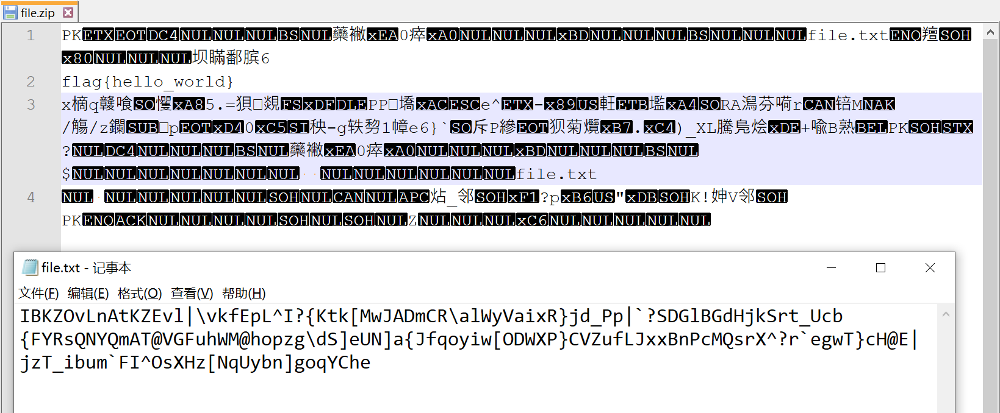
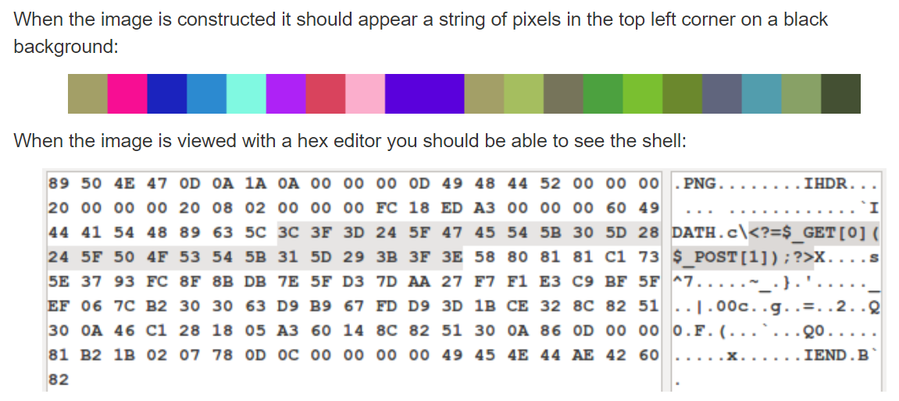

# [Algorithm] 鉴定网络热门烂梗

- 命题人：xmcp
- 虚无😰：250 分
- 欢愉🤣：200 分

## 题目描述

<p>根据摩尔定律，每过 18 个月，GeekGame 题面里的网络热门烂梗含量就会翻一倍。面对题面里越来越多的烂梗，选手们纷纷表示：<strong>下次多来点。</strong></p>
<p><center><p>
    
    <br><span style="opacity: 0.6">↑ 数据来自上届选手反馈</span>
</p></center></p>
<p>尽管如此，低质量的烂梗由于不包含任何有效信息，还是令一些人感到不适。为了鉴别梗的质量，我们从校际和平公司订购了最新产品——烂梗混淆器：</p>
<p>输入一段文本后，它会<strong>对文本进行异或和打乱处理，再进行 gzip 压缩。</strong>这样操作后，绝大多数低质量的烂梗将被完全混淆。由于预算有限，我们只部署了免费体验版，最多只能处理 1000 字，令人忍俊不禁。</p>
<p>那么，究竟是什么样的烂梗，才能在重重混淆之后依然维持自己的模样呢？前有绝景，敬请见证。</p>
<p><strong>提示：</strong></p>
<ul>
<li></li>
<li>无需关注编码过程的实现细节，也可以控制编码结果的一些性质保持不变。找个纯 Python 实现的 gzip <strong>解码器</strong> 就足以解出此题。</li>
<li>具体来说，可以试着把产生的 Huffman 表控制为等长的（每个字符都转换为同样多个比特）。两个 Flag 都可以在这个情况下解出。</li>
</ul>
<div class="well">
<p><strong>第二阶段提示：</strong></p>
<ul>
<li>gzip 使用 deflate 算法，它分为 LZ77 和 Huffman 编码两个步骤。</li>
<li>LZ77 仅在输入包含三个字节以上的重复子串时才起作用，其他时候可以当它不存在。Huffman 树的构造仅与字符的出现频率有关，而与顺序无关（数据的结束也会被视为一种字符）。</li>
<li>两个 Flag 的难度是相似的，只不过 Flag 2 可能需要大战 Datalab（bushi。</li>
</ul>
</div>

**[【附件：下载题目源码（algo-gzip.py）】](attachment/algo-gzip.py)**

**【终端交互：连接到题目】**

## 预期解法

发现混淆过程分为三步，分别是异或、打乱顺序（随机种子固定）、gzip压缩。输入长度不能超过 1000 且只能包括 ASCII 可打印字符。Flag 1 的目标是让产物前 256 字节的平均 popcount 小于 2.5，Flag 2 的目标是让产物出现特定的字节序列。

容易发现前两个步骤（异或和打乱顺序）都是可逆的，那么我们的目标就是找一种能控制 gzip 压缩产物的方法。

### 前置知识

在网上随便学学 gzip 的编码方式即可了解到，它首先经过一轮 LZ77 压缩把重复出现的字节消除掉，然后经过 Huffman 编码产生最终结果。如此 High-Level 的了解还不足以解出此题，所以我们去网上找个 gzip 的编码器看一看……坏了，看不了一点。所以我们去网上找个 gzip 的 **解码器** 看一看，这样至少能明白 gzip 产物的每个 bit 都是干什么用的。

不难找到一个 [Python 实现的 gzip 解码器](http://www.paul.sladen.org/projects/compression/)，但可惜它是 Python 2 的，需要简单移植到 Python 3。然后随便给它喂一个输入，带着调试器走一遍解码过程，能产生以下发现：

其一，gzip 产物的最开始是一个 Huffman 树，它可以是预先定义的 Fixed huffman code（`blocktype == 1`），也可以是随数据变化的 Dynamic huffman code（`blocktype == 2`）。考虑到我们的输入都是 ASCII 可打印字符，用 Dynamic huffman code 只需最多 6 - 7 bits，而 Fixed huffman code 需要 8 bits，所以但凡这个输入稍微长一点，Dynamic 的压缩效果都会比 Fixed 更优。因此，我们可以假设它的 Huffman 树是 Dynamic 的。

其二，Huffman 树的具体表示方法也比较有意思。它并非把整棵树的形状记录下来，而是仅记录了树上每个字符的长度。例如，Fixed huffman code 的具体表示方式如下：

```python
static_huffman_bootstrap = [(0, 8), (144, 9), (256, 7), (280, 8), (288, -1)]
```

含义是，码位为 0-143 的字节用 8 bits 表示，144-255 的字节用 9 bits 表示，256-279 的字节（256 是 EOF，其余是 LZ77 输出的用来表示重复序列的特殊字节）用 7 bits 表示，280-287 的字节用 8 bits 表示，288 以上的字节表示不出来。这样一来，解码器可以从全 0 开始依次给这些码位分配编码结果，因此可以确定性地还原出整棵树的形状。这种表示方法相比于把整棵树记下来更省空间。

其三，输入完 Huffman 树之后，解码器正式开始解码。循环里面用 Huffman 编码过一遍，如果是 0-255 就直接输出，如果是 256 就表示输入结束（EOF），如果大于 256 就说明是前面一段子串的重复，它有一个比较麻烦的 LZ77 解码过程。所幸至少三个字节以上的重复才会触发这个过程，因此我们的 payload 只要保证任意三个字节的子串都不相等，就可以忽略这个过程。

### 控制gzip产物的方法

铺垫至此，我们已经具有了控制 gzip 压缩产物的能力：

- 首先，保证 payload 的任意三个字节的子串都不相等，避免触发 LZ77，这样 gzip 就只剩 Huffman 的部分。
- 然后，随便给 gzip 扔一个字符串，可以通过解码器观察到它产生的 Huffman 树的形状。
- 接下来我们可以 **前后移动** 输入字符串里的部分字节，因为词频没变，所以 Huffman 树的形状不会变，因此 Huffman 树的编码没变，每个字符的码位也不会变，因此产物中的对应字节也会跟着前后移动。

我们还可以更近一步，不是前后移动来修改输入，而是直接构造输入：

- 给 gzip 扔一个包含 63 种字符、且字符出现频率都相等的输入。这种输入一定会产生每个码位都是 6 bits 的 Huffman 树，其中 000000-111110 是我们这 63 个字符，111111 是 EOF。
- 我们拿到这棵 Huffman 树之后，就开始构造输入。比如我们希望 gzip 产生比特序列 101100，就去查这个序列在 Huffman 树里是哪个字符，然后把它扔到输入里。
- 所有输入都构造完之后，在结尾填充一些垃圾数据，从而把字符出现频率都配平。

上述过程基本一定能成功，只要避免以下三种情况：

- 你的输入不慎包括了三个字节的重复子串，从而触发了 LZ77 坏了大事。
- 你要构造的比特序列不慎包括 111111，它是 EOF，所以弄不了。
- 你的输入太长了，导致 gzip 没有感受到词频的精妙，不慎选择了其他 Huffman 树的构造方式。

### Flag 1

Flag 1 的解法是在输入的开头堆很多码位 popcount 为 0、1、2 的字符。在所有 000000-111110 码位中，popcount 为 0 的有 1 个、popcount 为 1 的有 6 个、popcount 为 2 的有 15 个，以上共有 22 个码位，还有 41 个其余码位。

将这 22 个 popcount 不超过 2 的码位的对应字符以不同顺序（避免触发 LZ77）重复 15 遍，即可构造 `15*22==330` 个字节的输入，它们压缩完之后是 `15*22*6/8 = 247.5` 字节，且平均 popcount 为 `(0*1 + 1*6 + 2*15)/22/6*8 == 2.18`。由于产生的 gzip 有文件头，所以最终的 popcount 会比这个略高一些，大概在 2.3 到 2.4 之间的样子。目前最好的解法能做到 2.308 左右（精确数值取决于提交时间，因为 gzip 的文件头有时间戳）。

不要忘了后面再把其他码位的 41 个字符也重复 15 遍以配平词频，这需要 `15*41 == 615` 字节，因此输入字节总数是 945，正好没有超过限制。

### Flag 2

Flag 2 的解法也差不多，只是需要注意一下比特在字节中的位置，构造输入的时候要在开头 pad 一些比特来对齐到字节边界。其实这题本来只有 Flag 2，但我在出题的时候因为 Datalab 基础不够扎实，被比特顺序问题坑了好久，于是单独掰出来了一个 Flag 1：它不用管比特顺序，而且因为 2.5 bits 的限制比较宽松，可以放进来一些其他的好解法，我看不少人是用爬山算法做的（[Lysithea](../../players_writeup/44) 的爬山算法甚至出了 Flag 2，详情去看他的 Writeup）。

上述解法对应的脚本在 `sol/sol.py`。其中 `sol/deflate.py` 是那个解码器，我在里面添加了 `do_construct_null` 和 `do_construct` 两个函数，对应了两个 Flag 的构造步骤。

## 题目背景

其实这个题目能实现的效果还是比较有意思的，因为 deflate 的应用场景实在是太广泛了。比如 zip 文件就是用的 deflate，所以我们可以构造一段文本，使得它压缩之后能出现特定字符。比如：



当然，这里原文也未必全是乱码，可以放一些有意义的文字（反正最终把词频配平就行）。

我们甚至还可以更进一步，考虑到 png 也是用的 deflate 算法，那么就[可以构造一个图片](https://www.idontplaydarts.com/2012/06/encoding-web-shells-in-png-idat-chunks/)，使得它编码成 png 之后会变成一段 webshell（可以用来出毒瘤套娃 web 题）：



总之，希望做完这个题之后大家能对压缩算法有更深入的理解：就算你不能用画图画个 webshell 出来，至少也可以直接拍脑袋估测一段日志文件的压缩比。不觉得这很酷吗？
