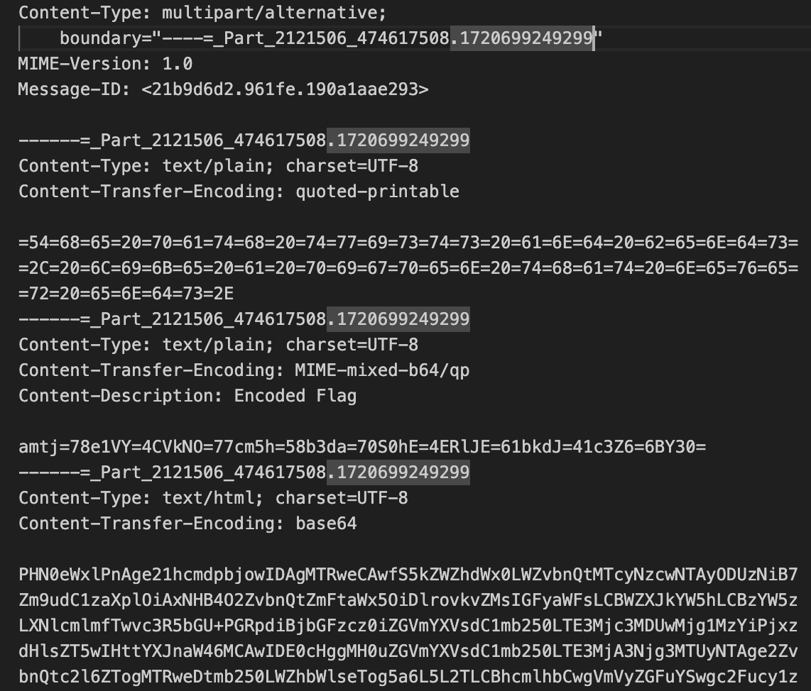
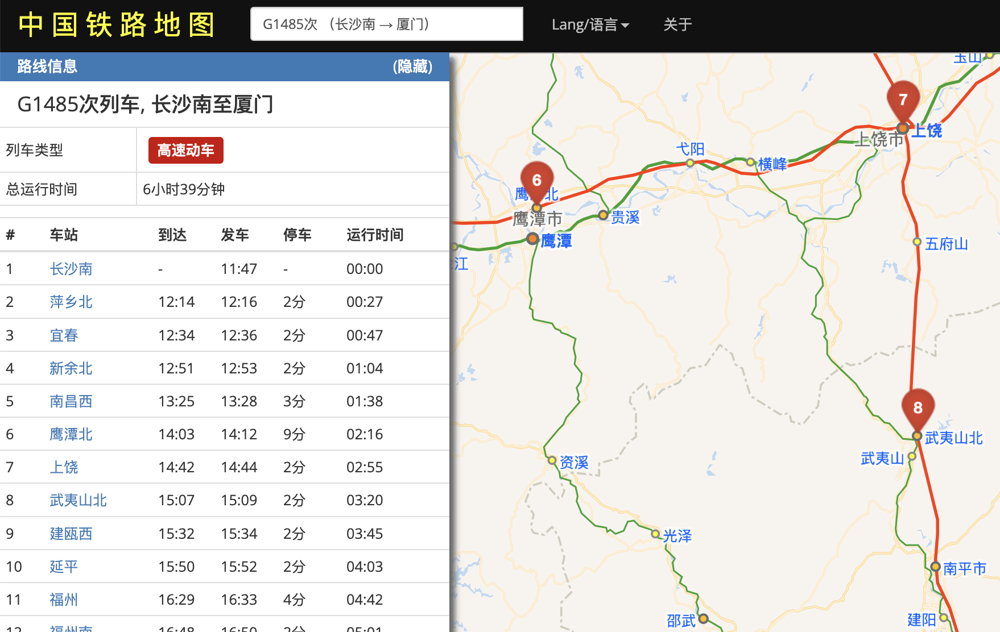

# [Misc] 新穷铁道

- 命题人：echo
- 题目分值：300 分

## 题目描述

猪猪是一位铁道爱好者。每每看到蜿蜒的铁道向远方延伸，<strong>猪猪都有种回家般的亲切。</strong>

然而，正如无数前辈们的血泪史所反复证明的，沉迷铁道的最终归宿只能是 <em>身无分文</em>。

随着猪猪的运转行程抵达京北，也终于已山穷水尽。希望从它的求助邮件中可以看出一点信息。

<blockquote>

玩铁道玩的。

</blockquote>

<strong>第二阶段提示：</strong>

<ul>
<li>【铁道知识科普】最基本的将车次分为两类的依据是上下行，也就是车次号的奇偶性。每个车次在指定到发站之间的轨迹构成了猪圈密文图案</li>
<li>密码本之外的字符或许真的没有实际意义呢……也许只是个分隔符？</li>
<li>既然是MIME的两种编码方式mixed-encoded的数据，就应该分段mixed-decode再组合</li>
</ul>

**[【附件：下载题目附件（misc-erail.jpg）】](attachment/misc-erail.jpg)**

## 预期解法

### 图片包含的邮件结构解析

拿到附件图片之后，010打开拉到最后即可发现一段直接拼接上去的文本内容。从`Date: Thu, 11 Jul ...` 开始，提取出来是一个电子邮件格式的文件（Erail.eml）。该multipart类型的邮件按照boundary参数可划分为 3 个部分。

这里需要注意的是，如果直接拿电子邮件客户端打开此 eml 文件，则只会渲染出最后的text/html部分。这是来源于multipart/alternative 类型的特性。

第一个 text/plain 部分是用 quoted-printable 编码的一段文本。其实按照quoted-printable的定义，ASCII字符可不必编码直接呈现，这里则刻意对所有字节都按照 `=xx` 形式编码了（其实是为了照应下面的mixed-b64/qp）。解码内容是：

> The path twists and bends, like a pigpen that never ends.

这里再次出现了pigpen这个词，结合题面内容，其实都是在提示后续需要用到 `猪圈密码` 这种东西。

### mixed-encode 解码

第二部分的 Content-Transfer-Encoding 头声明为 MIME-mixed-b64/qp，这当然是种无效的编码方案。事实上，MIME 定义的二进制编码方案也就是 base64 和 quoted-printable 两种，分别对应本题目邮件的第一和第三部分；第二部分的编码其实就是把两种混合在一起了。base64 和 quoted-printable 的特征分别是 `每3个字节编码为4个ASCII字符` 和 `1个字节编码为=xx` ；据此特征即可看出 MIME-mixed-b64/qp 的实际做法是将数据 3 个字节按base64编码、然后1个字节按quoted-printable编码……，以此类推。由此解码得到：

> jkcx{UXLVCNwrnaXowZpKHDNFRDanGIAsvzkc}

这个字符串已经是flag的形状了。

### 猪圈密码与 Vigenere 密码

最后来看第三部分。邮件客户端渲染出来是一个包含众多车次和区间的表，“友情链接”指向的网站可以用来查询这些车次信息。如果前面已经 get 到了 `猪圈密码` 这个要点，这里其实就会有意识地去观察每个车次在给定区间的形状。

比如 `G1485 鹰潭北-武夷山北` ，看地图上这段区间近似就是一个 `¬` 形，所以对应了猪圈密码中的字母“G”。大致思路如此，不过要完整解码还有几个要点：

* 注意到列表中古怪的D1/D2次，这两个地图上看就是一条竖线，不对应任何猪圈记号，所以其实只是分隔符，以及提示一下 `列车车次奇偶数` 这一特点
* 猪圈记号分为带附点和不带附点两套，区分方式就是车次上下行，即车次号奇偶数：奇数不带附点，偶数带附点（反过来的话，解码不成文）
* 有几个始发终到站相同的车次，轨迹比较抽象；其实对应的就是唯一的闭合猪圈记号（e 或者 n）

最后对所有车次依照猪圈密码解密的结果是：

> vigenerekey||ezcrypto

第二部分的加密方式 Vigenere 赫然眼前。直接应用密钥 `ezcrypto` 得到最终flag：

> flag{WISHYOuaplEasAnTJOURNEywITHerail}

