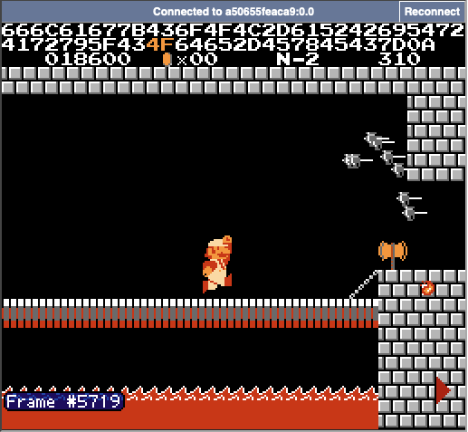

# [Misc] TAS概论大作业

- 命题人：MaxXing、xmcp
- 你过关：150 分
- 只有神知道的世界：200 分
- 诗人握持：350 分

## 题目描述

<p><b>【课程教材：《不时轻声地用TAS术语遮羞的马里奥同学》】</b></p>
<blockquote>
<p>“21 帧规则，那个……<ruby>flagpole glitch<rt>布拉琪</rt></ruby>……”</p>
<p>“诶，什么？”</p>
<p>“没什么，只是说了一句 ‘这家伙真是个闸总’。”</p>
<p>“能不能停止用 <a target="_blank" rel="noopener noreferrer" href="https://en.wikipedia.org/wiki/Tool-assisted_speedrun">TAS</a> 术语骂人？！”</p>
<p>坐在我旁边的那位绝世红帽大叔，马里奥的脸上浮现出了因拿到了状态而骄傲的笑容。</p>
<p>……但是，事实不是这样的。刚才他说的明明是“你再不 A 上去（指按 A 键）过关的时候就要放炮了”！</p>
<p>其实我，拥有着世界顶级的 TAS 操作，就算在实机，也可以用 1/60 秒的速度穷尽手柄按键的所有排列组合。</p>
<p>完全不知道这件事而且今天也用甜言蜜语来撒娇的马里奥实在是让人忍不住发笑？！</p>
<p>与全体 speedrunner 憧憬的、超高规格可爱的意大利水管工的 <del>青春爱情</del> 喜剧！</p>
</blockquote>
<p><b>【Flag 1：你过关】</b></p>
<p><strong>在 600 秒内通关红白机版超级马里奥兄弟。</strong></p>
<p>需提交通关过程中的手柄输入文件。文件中的每个字节代表每帧的输入，从最低位到最高位依次表示是否按下 A、B、选择、开始、上、下、左、右键。可以使用题目提供的手柄输入编辑器完成操作（但是很难用），也可以在本地用模拟器（如 <a target="_blank" rel="noopener noreferrer" href="https://fceux.com">FCEUX</a>）录制输入，转换格式后上传。</p>
<p>手柄输入结束时，游戏必须处在 8-4 关马里奥和公主的画面。游戏 ROM、示例输入、评测脚本等见附件。</p>
<p><b>【Flag 2：只有神知道的世界】</b></p>
<p><strong>在 90 秒内进入<a target="_blank" rel="noopener noreferrer" href="https://www.mariowiki.com/Minus_World">负世界</a>。</strong></p>
<p>手柄输入结束时，游戏必须处在任意负世界关卡（实际上这个版本的游戏里 -1 关是无限循环的，所以只能是 -1）。</p>
<p><b>【Flag 3：诗人握持】</b></p>
<p>没有通关条件，但是评测脚本会<strong>将 Flag 3 附加到你的手柄输入之后。</strong>也就是说，在播放完你的输入后，Flag 3 中的每个字节会被解释为手柄按键，逐帧输入到游戏中。请通过游戏输出的画面，分析 Flag 3 的内容。整个流程需在 300 秒内完成。</p>
<p>由于这个 Flag 太过逆天，除输入文件外，你还可以提交一个 2048 字节的二进制文件。模拟器在播放你的输入之前，会将其填充进红白机的 <code>0x0000-0x07ff</code> 内存处。</p>
<p><strong>提示：</strong></p>
<ul>
<li>输入格式<strong>不是</strong> fm2，而是每帧一个字节，因此输入长度限制等于帧数限制，请询问长度限制的选手仔细审题</li>
<li>Flag 3：看看 <a target="_blank" rel="noopener noreferrer" href="https://tasvideos.org/8991S">Bad Apple</a></li>
</ul>
<p><strong>如果你在本地运行结果和在线评测不符：</strong></p>
<ul>
<li>试试使用题目附件中提供的 <code>bin2fm2.py</code> 将你提交的二进制文件转换为 FM2 格式，并使用 FCEUX 播放，此时的结果应该与在线评测一致，你可据此调试你的输入；</li>
<li>为了兼容不同模拟器输出的录像格式，<code>bin2fm2.py</code> 会在生成的 FM2 文件开头插入一帧用来执行红白机的复位操作，请检查你提交的文件开头是否多/少了一帧的输入。</li>
</ul>
<div class="well">
<p><strong>第二阶段提示：</strong></p>
<ul>
<li>Flag 1：红白机马里奥最短的通关路线为 1-1、1-2、4-1、4-2、8-1、8-2、8-3、8-4，但既然都 TAS 了，不如去<a target="_blank" rel="noopener noreferrer" href="https://tasvideos.org/">这个网站</a>找找其他人的录像。</li>
<li>Flag 2：进入负世界需要<a target="_blank" rel="noopener noreferrer" href="https://www.bilibili.com/video/BV1oW411Q7Le">在 1-2 跳关处卡墙</a>，有些不以进入负世界为目的的 TAS 录像已经做到了这一点，你只要用 FCEUX 的 <a target="_blank" rel="noopener noreferrer" href="https://fceux.com/web/help/TASEditor.html">TAS Editor</a> 对其稍加修改即可达成条件。</li>
<li>Flag 3：基本原理如 <a target="_blank" rel="noopener noreferrer" href="https://tasvideos.org/8991S">Bad Apple</a> 所示，你需要设置内存使游戏从 N-1 开始，保留火花状态一路打到 N-2，并使用火花击杀库巴。在击杀前的一瞬间按住 A 键，即可使 CPU 跳转执行 0x1181（即内存 0x0181）处的代码。你应在此放置一个可以读取手柄输入并显示到屏幕上的 payload。需要注意：<ul>
<li>部分模拟器生成的录像文件中可能出现大量 lag frame（滞后帧），这和其他大部分模拟器的行为不符（说的就是你，BizHawk 的 SubNESHawk 模式）。游戏在普通帧中会同时更新画面和读取输入，在 lag frame 中只会更新画面而不会读取输入。此类录像文件在 FCEUX 中无法正常播放，Bad Apple 的录像很不幸就属于这种情况，你可能需要把开头的部分重打一遍。</li>
<li>FCEUX 的 TAS Editor 在制作 TAS 录像时不能修改红白机的内存，你可以尝试修改 FCEUX 的源码，或者换一个支持修改内存的模拟器（例如 BizHawk）来手打 TAS 录像。</li>
</ul>
</li>
</ul>
<p><strong>可能对你有帮助的链接：</strong></p>
<ul>
<li><a target="_blank" rel="noopener noreferrer" href="https://www.masswerk.at/6502/6502_instruction_set.html">6502 指令系统手册</a></li>
<li><a target="_blank" rel="noopener noreferrer" href="https://www.nesdev.org/wiki/Programming_guide">NES 编程指南</a></li>
<li><a target="_blank" rel="noopener noreferrer" href="https://gist.github.com/1wErt3r/4048722">马里奥反汇编</a></li>
</ul>
</div>

**[【附件：下载题目附件（misc-mario.zip）】](attachment/misc-mario.zip)**

**【网页链接：访问题目网页】**

## 预期解法

大家好啊，我是 MaxXing，今天来点大家想看的东西。

这次题目的思路是 xmcp 提供的。最开始我们是想出一个关于超级马里奥的 pwn 题，大概就是那种“手柄一通操作输入一堆申必代码之后游戏就通关”之类看起来很炫酷的操作。

这种操作的学名叫做任意代码执行（Arbitrary Code Execution，ACE）。关于马里奥系列的 ACE，最经典的例子有两个：

* **超任（Super Famicom 或者叫 SNES）平台的超级马里奥世界（Super Mario World）**：[实机 41.022 秒通关](https://www.youtube.com/watch?v=mDUt198P6FM)，还有个更离谱的[在游戏里注入其他游戏](https://www.youtube.com/watch?v=OPcV9uIY5i4)的例子。
* **红白机平台的超级马里奥三代（Super Mario Bros. 3）**：[利用基于 ACE 的 wrong warp 技巧速通](https://www.youtube.com/watch?v=fxZuzos7Auk)。

但以上两个例子最大的问题是，要想实现 ACE，你必须精确操控游戏里某些物品的 X、Y 坐标或者其他状态，比如龟壳。为了完成 pwn，选手必须自己打出这种操作，然而即便可以利用 TAS，这类操作对于毫无经验的新手来说也有点太难了（我自己就是新手）。

于是，在一通别样的搜索大战之后，我找到了一个基于红白机超级马里奥一代（Super Mario Bros.）的 ACE 的例子，也就是这个 [Bad Apple](https://tasvideos.org/8991S)。它有几点好：

1. 基于广为人知的初代超级马里奥，有坚实的群众基础。
2. 流程不长，且整个过程不需要穿墙之类的单帧操作，你水平还行的话完全可以不用 TAS 手打。
3. ACE 的 payload 是预先载入到内存里的，不需要用各种奇怪的方式输入到游戏中去。虽然这样看起来有点耍赖，需要借助换卡带之类的第三方手段操作内存，不如前两个例子的整体性强，但贵在简单。

在坐牢一整个十一假期，爆看四五个红白机模拟器的源代码（甚至给其中的一些提了 PR），手打 + TAS 若干轮之后，我终于把这道题搞定了。

意外的是，这道题本来打算出成 binary 的，可能是考虑到前两个 flag 的成分，还是被 xmcp 放到了 misc 分类下。至于为什么要有前两个 flag，主要是因为上来就让大家 ACE 有点不太友好，还是需要两个和 TAS 相关的 flag 来缓冲一下难度，同时维持和题目标题的联系。

当然，这也导致了本题第三个 flag 和前两个之间难度上的割裂（主要是第三个 flag 相比前两个步骤太多，而且不好 debug），我再次背大锅，向大家道歉……

最后，感谢 xmcp 和 thezzisu 在搭建本题 web 前端方面的的协助！

> [!NOTE]
> **关于译名的叠甲**：我注意到有选手吐槽“马里奥”的官方中文译名应为“马力欧”，**我个人**向来对日本人把机器猫翻译为“哆啦A梦”、把喷射战士翻译为“斯普拉遁”的行为不感冒，所以在此选择了**我主观感受上**中国大陆游戏圈子内接受程度相对较高的“马里奥”来称呼マリオ。如有冒犯，你当看一乐即可。

> [!NOTE]
> **关于 TAS 相关术语的叠甲**：我本人只是一个喜欢看别人打 TAS 的游戏爱好者，但几乎从没自己打过 TAS。因此，尽管我已经尽力避免，但依然可能会在一些地方出现表述上的错误，敬请见谅。
>
> 例如之前提示中关于 lag frame 的表述被指出，“lag frame”的说法非常外行（虽然模拟器源码里也是这么写的），其存在的意义是为了支持 subframe 操作，并非一无是处。
>
> 如果你跟我一样外行，请勿轻信我所描述的内容，如有需要，请自行查证。

### Flag 1：你过关

如果你玩过初代马里奥的话，这道题基本上就是送分题。你只需要在模拟器中，按照 1-1、1-2、4-1、4-2、8-1、8-2、8-3、8-4 的路线打通游戏，然后把录像转换成题目要求的格式，即可拿到 flag。

如果你没玩过，但意识到了什么是 TAS，并且擅长搜索，那这道题更是送分中的送分。你可以尝试搜索：“nes super mario tas movie”，之后不难看到 TASVideos 网站的[专题页面](https://tasvideos.org/1G)。在其中找一个时长小于 10 分钟的录像，比如 [HappyLee 的世界纪录](https://tasvideos.org/1715M)（这位是国人，在 B 站也有[账号](https://space.bilibili.com/1497270)），简单分析 FM2 的录像格式之后，写个脚本转换一下格式即可：

```python
import sys

def parse_line(line: str) -> int | None:
  if not line.startswith('|'):
    return None
  input = line.split('|')[2]
  assert len(input) == 8
  bits = 0
  for i in range(8):
    bits = (bits << 1) | int(input[i] != '.')
  return bits


with open(sys.argv[1]) as f:
  with open(sys.argv[2], 'wb') as out:
    for line in f:
      bits = parse_line(line)
      if bits is not None:
        out.write(bits.to_bytes())
```

### Flag 2：只有神知道的世界

和 flag 1 类似，区别是为了进入负世界，你需要在 1-2 的跳关处穿墙，在跳关目标还没被加载出来之前，进入最左边的管道。

有两种方式，一种是找现成的录像，注意尽量不要找 FDS（磁碟机系统）平台的录像，这个和普通的红白机还是有些区别的，两者并不可以直接互换。然而我并没找到，但有些选手似乎找到了，你不妨去看看他们的 writeup。

另一种就是[自己打](https://www.bilibili.com/video/BV1Fy411B7KE/?t=18)，或者基于现有录像的前半段，自己打后半段。比如之前提到的 HappyLee 的 TAS 录像就利用了 1-2 穿墙的技巧跳关，基于这个录像很容易改出一个进入负世界的版本。

### Flag 3：诗人握持

Flag 3 的预期解法和 Bad Apple ACE 的流程如出一辙。

首先，修改内存，让游戏初始化之后可以直接从 N-1 续关。查询[游戏的反汇编](https://gist.github.com/1wErt3r/4048722)得知，游戏初始化后会检查内存的两个位置：

* `0x07d7` 处的最高分纪录中每个字节的数值必须小于 10。
* `0x07ff` 处必须为 `0xa5`。

否则，游戏会拒绝从 `0x07fd` 处读取关卡记录。将上述位置设置妥善，并将 `0x07fd` 修改为 `0x16`，才可从 N-1 续关。

游戏初始化后，同时按 A 键和开始键即可续关。在通关 N-1 的流程中，你需要让马里奥拿到火花的状态，为击杀库巴做准备。

之后，一路打到 N-2 关底。第 N-1 和 N-2 关属于卡了游戏的 bug，并非游戏中预期会出现的关卡，因此它们的内容分别和 8-3、8-4 关几乎完全一致，区别是 N-2 不存在类似 8-4 中的循环点，所以一直走就可以见到库巴。

接下来，使用火花打出五个火球击杀库巴。在第五个火球接触库巴之前，按住 A 键，此后游戏会经过一系列流程，跳转执行 `0x1181`（即内存 `0x0181`）处的代码。关于此过程的详细解释请参考 [Bad Apple 中的文字说明](https://tasvideos.org/8991S#ExecutingArbitraryCode)，或者[对应视频](https://www.youtube.com/watch?v=Wa0u1CjGtEQ)。

最后，你需要编写一份把手柄输入显示在屏幕上的 6502 程序，在游戏初始化之前，把它放在内存的对应位置。超级马里奥中，可供你放置这份 payload 的未初始化内存总大小只有大概 138 字节，所以你的程序不能写得太复杂。

[我实现的 payload](sol/flag3-mem.S) 的流程大致如下：

1. 初始化 PPU 状态，使其加载 `0x1000` 作为 background pattern table，以便输出 16 进制字符。此外，关闭 vblank NMI，避免 CPU 执行超级马里奥本来的中断处理代码，破坏内存的数据（好家伙，谁破坏谁啊）。
2. 死循环，直到 vblank 出现，这代表旧的一帧已经结束了，新的一帧即将开始。
3. 读取当前帧的手柄输入，大小为一个字节。
4. 判断这个字节如果为 0（flag 中一定不会出现 `'\0'`），则忽略这次输入，继续等下一帧。这部分是为了避免刚执行 payload 时屏幕上出现无关内容。
5. 将输入的字节分成高 4-bit 和低 4-bit，分别算出对应的 16 进制字符 pattern 的地址，写到 PPU 的 nametable 中。
6. 更新地址指针、PPU 滚动偏移量等杂项内容。
7. 画面更新完了，回到第 2 步，接着等下一帧。

终于，在播放完录像之后，你可以看到这样的画面：



将画面顶端的 16 进制按 ASCII 转换为字符，即可得到最终的 flag。
