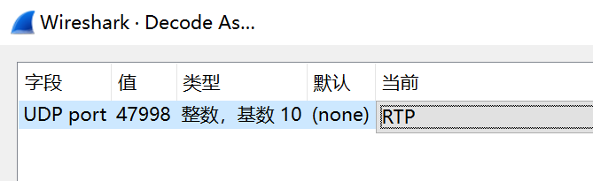

# [Misc] 熙熙攘攘我们的天才吧

- 命题人：xmcp
- Magic Keyboard：150 分
- Vision Pro：250 分
- AirPods Max：250 分

## 题目描述

<p>嫌疑人祥某，第三新燕园校区第三新<ruby>物理暨化学<rt>&ensp;智能&ensp;</rt></ruby>学院诺班学生，因涉嫌在 GeekGame 中作弊被兆京大学心中算计传唤调查。</p>
<p>祥某称，自己家境贫寒，为了在上学期间能打工赚钱，买了很多苹果产品来提升自己的生产力。谁能料到，这使她本不富裕的生活更是雪上加霜。苹果即将发售下一代 iPhone SE，但她手中存款告急，祥某为了奖金决定参加 GeekGame 比赛。</p>
<p>在参赛期间，祥某用来做题的 12 寸 Macbook 突发键盘故障无法使用。祥某立即将电脑送往天才吧™维修，但得知返厂检测需要一辈子时间且不提供备用机，祥某无奈只能借同学的 Windows 电脑做题。</p>
<p>由于受到加利福尼亚生活方式的长期影响，祥某对 Windows 电脑严重过敏，情急之下<strong>用自己的其他苹果设备远程串流</strong>答题，但生产力依然十分低下，几天过去没有再做出一道题。眼看着赛程迫在眉睫，为了确保奖金到手，祥某想到自己在华清大学念书的中学同学似乎也参加了 GeekGame，遂产生了歪念头……</p>
<blockquote>
<p>“以上笔录我已看过，说得和真的一样。”  —— 嫌疑人S</p>
</blockquote>
<p>心中算计通过<ruby>技术手段<rt>线下真实</rt></ruby>获得了祥某<strong>作案时的流量数据</strong>和<strong>电脑上的日志文件</strong>。现在请你来还原她的作案过程。</p>
<p><strong>提示：</strong></p>
<ul>
<li>三个 Flag 分别可以通过分析键盘、视频、音频数据获得</li>
<li>如果跳过 Flag 2 直接做 Flag 3，需要知道 Flag 3 的格式是 <a target="_blank" rel="noopener noreferrer" href="https://regexper.com/#%5Eflag%5C%7B%5Cd%2B%5C%7D%24"><code>^flag\{\d+\}$</code></a></li>
<li>有多名选手表示解码音频报文过于困难，但实际上转换为原始 Opus 报文 <a target="_blank" rel="noopener noreferrer" href="/service/attachment/misc-sunshine/misc-sunshine-decrypt.py">仅需 15 行</a></li>
</ul>
<div class="well">
<p><strong>第二阶段提示：</strong></p>
<ul>
<li>Flag 1：Sunshine 会把键盘事件 <a target="_blank" rel="noopener noreferrer" href="https://github.com/LizardByte/Sunshine/blob/6fa6a7d515b672041a9090b7f2357a0f0e2900d1/src/input.cpp#L264-L272">记录到日志里</a>。</li>
<li>Flag 2：出题人先用 WireShark 解析并导出了 RTP 报文，然后写了大约几十行的 Python 脚本来还原完全清晰的 H264 视频流，但你不需要做得这样严谨。</li>
<li>Flag 3：看看 <a target="_blank" rel="noopener noreferrer" href="https://github.com/LizardByte/Sunshine/blob/6fa6a7d515b672041a9090b7f2357a0f0e2900d1/src/audio.cpp#L111-L141">Sunshine 的音频格式</a>，它并非常见的 OGG 封装的 Opus 音频。</li>
</ul>
</div>

**[【附件：下载题目附件（misc-sunshine.zip）】](attachment/misc-sunshine.zip)**

**[【隐藏附件：misc-sunshine-decrypt.py】](attachment/misc-sunshine-decrypt.py)**

## 预期解法

下载附件可以得到一个 pcap 和一个 log。在里面随便翻翻，不难发现是串流软件 sunshine 的运行日志和对应的网络流量。

### Flag 1

Flag 1 希望我们分析键盘输入的数据。所幸这些输入数据直接记录在了 log 文件里，比如这段：

```
[2024:09:30:17:14:42]: Debug: --begin keyboard packet--
keyAction [00000003]
keyCode [8041]
modifiers [00]
flags [00]
--end keyboard packet--
```

就表示一个键盘事件。我们可以直接翻看 sunshine 的源码并搜索出来对应的函数：


继续看看源码或者连蒙带猜即可明白这个 log 的含义：

- `keyAction` 为 3 表示按下按键，4 表示抬起按键。
- `keyCode & 0xff` 表示按键码，其中字母的按键码就等于它的 ASCII 码，[其他按键（比如 shift）有特殊的按键码](https://github.com/LizardByte/Sunshine/blob/fb712e30a06eb5824d1d8803c5886871aeb21231/src/input.cpp#L41-L49)。
- `modifiers` 和 `flags` 不用管。

于是写个脚本 parse 一下所有键盘输入，即可得到 Flag 1。详见 `sol/decode_keyboard.py`。

### Flag 2

Flag 2 需要解码 sunshine 的视频数据。sunshine 的视频数据默认是在局域网内不加密，如果是广域网而且客户端支持（反正出题用的 iOS 版 moonlight 不支持）则加密。如下图所示：


我们首先的步骤是找到视频数据在哪。这一步的方法很多，你可以 [看看文档](https://docs.lizardbyte.dev/projects/sunshine/en/latest/about/advanced_usage.html#port)：


或者看看 log：


或者看看哪个端口流量最多就是视频数据：


知道端口是 47998 而且使用的协议是 RTP 之后，我们可以在 WireShark 里解码一下：




然后把解析结果导出成 JSON 方便后续写脚本处理：


接下来就是索然无味的 [对着 sunshine 源码](https://github.com/LizardByte/Sunshine/blob/190ea41b2ea04ff1ddfbe44ea4459424a87c7d39/src/stream.cpp#L81) 强行解码的过程。其实里面所有关于纠错的部分都可以不用实现，因为这个 pcap 是在本机录制的，保证零丢包。

我写的脚本在 `sol/decode_video.py`，它能直接把 JSON 结果转换成 100% 精确（毫无花屏）的 H264 视频流，拿 ffmpeg 放一下就能看到 Flag。下面是转换成 MP4 之后的视频：

https://github.com/user-attachments/assets/f346468c-59b7-4381-aef7-72861ac7c2d0

当然，我做得这么复杂纯粹是因为我是出题人，需要给一个比较严谨的解法，而你可以各种胡搞。GeekGame是这样的，选手只需要糊出 Flag 就好了，而出题人考虑的可就多了。第二阶段提示就在暗示这一点，可惜有人没看懂，还怪提示没用，我不说是谁。


具体怎么胡搞呢？比如说，有很多选手直接把 RTP 数据甚至是 47998 端口的全部 UDP 数据一股脑扔给 ffmpeg，基于 H264 的超强纠错能力，能在花花绿绿的画面里勉强看到一点 Flag。清晰度大概这样：


也有选手试图从 Moonlight 的代码里抄解码逻辑，听说 Moonlight 的代码质量比 Sunshine 好一些。总之各种胡搞方法可以参见选手 Writeup。

如果你试图写精确的解码脚本但解出来还是存在少量花屏，欢迎跟我的脚本对拍一下看看问题在哪。

### Flag 3

Flag 3 需要解码 sunshine 的音频数据。类似可得，音频数据是在 48000 端口传输的 RTP 流。

坏消息：与视频不同，音频数据是着实 AES 加了密的。好消息：秘钥和 IV 在 log 里都有。


然后就是同样索然无味的过程，在 WireShark 里解析一下 RTP、导出成 JSON、然后拿 Python 一通乱写。解码脚本详见 `sol/decode_audio.py`。

写的过程还是比较 tricky 的，我遇到的最大坑点在 sunshine 源码里的这一行：


因为 AES 的 IV 是 16 字节，所以它这么一通操作之后其实只赋值了指针的前 4 个字节，而后 12 字节全置零。当时忘了 truncate 到 uint32，调了好久，所以为了避免折磨大家，在第一阶段就把解码脚本送上门来了。

解码完了之后得到一堆长度 120 字节的妙妙数据包。ffmpeg 解一下发现解不动，网上搜一下 Opus 解码工具发现全都解不动，但这些数据包都是 `\xd4` 或者 `\xf4` 开头的，感觉很真。怎么回事呢？噢，原来这些工具能解的所谓的 Opus 都是经过 OGG 格式封装的，而 sunshine 直接传的是裸的 Opus 流，用的是 [Opus Multistream API](https://opus-codec.org/docs/opus_api-1.3.1/group__opus__multistream.html)。怪不得解不动。

所以对着这个 API 写一下解码的逻辑就完事了，我是直接用的 Opus 的 C 库，源码在 `sol/opus_demo.c`。有不少选手找到 Python 的 binding，总之都能用。运行这个解码程序得到一个 PCM 格式的音频，接下来 Audition 启动！


然后定位到视频里面那段有声音的地方：


如果你的生活经验比较丰富（<del>年龄比较大</del>），或者看过柯南，或者在比赛期间调戏过客服小祥，或者问过 ChatGPT，再结合题面说的 Flag 格式是纯数字，都不难意识到这是一段 DTMF 编码的拨号音。还原一下即可得到 Flag 3。转换成 MP3 之后的音频详见 [sol/data/decoded.mp3](sol/data/decoded.mp3)。

有的选手解出来音频的频率不对，建议对拍一下看看你的 API 是不是用法有问题，或者最后不小心按单声道打开了之类的。
