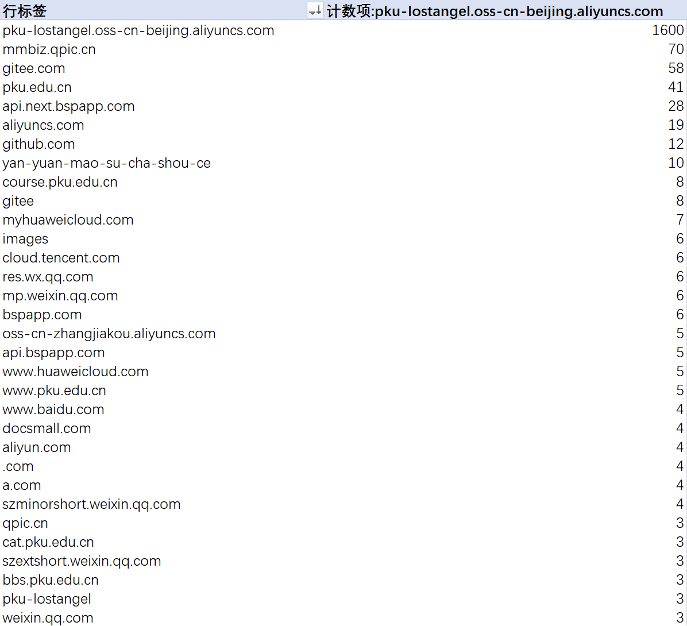
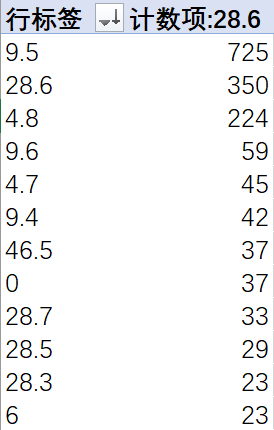
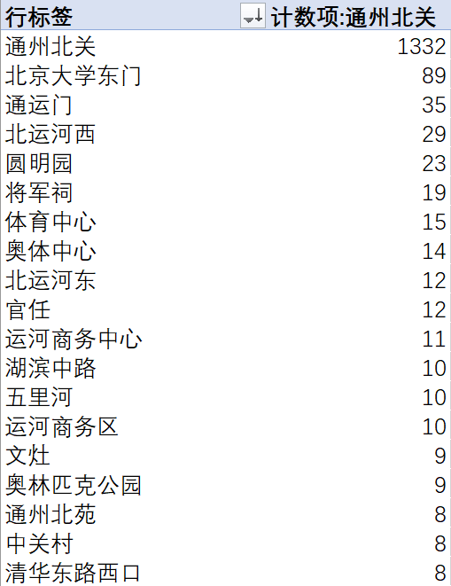

# [Misc] 清北问答

- 命题人：xmcp、debugger
- Flag 1：150 分
- Flag 2：200 分

## 题目描述

小北问答是 PKU GeekGame 的经典题目，主要目的是通过问答题的形式检验选手<strong>在互联网上查找信息</strong>的能力。

然而今年的参赛选手同时包括北京大学和清华大学的学生，因此这道题目的命名就成了世纪难题。请问阁下将如何应对？

<ul>
    <li>叫 “<b>清北问答</b>”，因为大家都是这么叫的。</li>
    <li>叫 “<b>北清问答</b>”，不服就让北清路改个名。</li>
    <li>叫 “<b>清华大学问答</b>”，即分别取清华大学的前两个字和北京大学的后两个字。</li>
    <li>叫 “<b>北大问答</b>”，即根据两所学校的地理位置中点：中关村北大街来命名。</li>
    <li>在北大叫 “<b>小北问答</b>”、在清华叫 “<b>大清问答</b>”。 但对于其他校外选手就<b>不知道叫什么</b>了。</li>
    <li>叫 “<b>清北问答</b>”，以符合 <a href="https://arxiv.org/pdf/2304.01393" target="_blank" rel="noreferrer">学术界的最佳实践</a>。</li>
</ul>

但无论阁下如何应对，规则都是一样的：<strong>答对一半题目</strong>可以获得 Flag 1、<strong>答对所有题目</strong>可以获得 Flag 2。

<strong>第二阶段提示：</strong>

<ul>
<li>第 5 题：PulseAudio 的 <code>pactl get-sink-volume</code> 命令可以看当前音量的分贝值。当然你也可以看源码。</li>
<li>第 6 题：这个建筑物不在北大校内，但是和北大校内的一个建筑物存在某种联系。</li>
</ul>

**【网页链接：访问题目网页】**

## 预期解法

### Q1

> 在清华大学百年校庆之际，北京大学向清华大学赠送了一块石刻。石刻**最上面**一行文字是什么？
>
> 答案格式：`^[\u4E00-\u9FFF\w]{10,15}$`
>
> 答案：`贺清华大学建校100周年`

首先通过各种手段找到这块石头的照片，比如 [这篇公众号](https://mp.weixin.qq.com/s?__biz=MTI0MDU3NDYwMQ==&mid=2656664430&idx=1&sn=7865ab67e46631403412369287378e7f&chksm=7a6386884d140f9ed4a4c59597b6d611b82b2b430b3e247a3e7a33418d3a49f24bf956fe3f64&scene=27) 和 [维基百科](https://commons.wikimedia.org/wiki/File:%E6%B8%85%E5%8D%8E%E5%8C%97%E5%A4%A7%E5%8F%8B%E8%B0%8A%E9%95%BF%E5%9C%A8%E7%9F%B3.jpg) 上面都有。如果你是校内选手，也可以选择线下观看。

需要注意本题答案不是 “清华北大友谊常在”，因为它上面还有一行字。问最上面这行字而不是 “清华北大友谊常在” 是为了防止校内选手对这八个字印象深刻从而对此题获得过大的相对优势 <del>逃课</del>。本题通过答案格式里的字数限制避免了选手不小心输入这个错误答案。

### Q2

> 有一个微信小程序收录了北京大学的流浪猫。小程序中的流浪猫照片被存储在了哪个域名下？
>
> 答案格式：`^[a-z.-]+$`
>
> 答案：`pku-lostangel.oss-cn-beijing.aliyuncs.com`

首先搜到这个小程序叫 “燕园猫速查手册”。

然后，抓包，启动！

不抓包的话也可以做。先找到小程序源码的[仓库](https://gitee.com/circlelq/yan-yuan-mao-su-cha-shou-ce)：

然后在代码里的各种地方都能找到这个域名。

### Q3

> 在 Windows 支持的标准德语键盘中，一些字符需要同时按住 AltGr 和另一个其他按键来输入。需要通过这种方式输入的字符共有多少个？
>
> 答案格式：`^\d+$`
>
> 答案：`12`

看看 [维基百科](https://en.wikipedia.org/wiki/German_keyboard_layout)，或者 [微软文档](https://learn.microsoft.com/en-us/globalization/windows-keyboard-layouts)，数出来共有 12 个字符。计数题最简单的一集.jpg

### Q4

> 比赛平台的排行榜顶部的图表是基于 `@antv/g2` 这个库渲染的。实际使用的版本号是多少？
>
> 答案格式：`^[\d.]+$`
>
> 答案：`5.2.1`

先去看比赛平台的前端源码。发现 Git 仓库里喜提 `package-lock.json` 文件，在里面搜索可得。或者直接 `npm install` 一下也行。

爱你.jpg

注意到有很多人被这行误导从而写了 `5.1.18`：

如果你仔细看了前面几行的内容，就会注意到它的实际含义是比赛平台依赖的 `@ant-design/plots` 这个库它依赖于不低于 `5.1.18` 版本的 `@antv/g2`。因此，这并不是实际使用的版本号，只是一个最低的限制。

### Q5

> 在全新安装的 Ubuntu Desktop 22.04 系统中，把音量从 75% 调整到 25% 会使声音减小多少分贝？（保留一位小数）
>
> 答案格式：`^\d+\.\d$`
>
> 答案：`28.6`

最方便的方法是拿 U 盘刻个 22.04 的 LiveCD 玩玩或者开个虚拟机玩玩。用百度以外的搜索引擎搜索 “ubuntu command line set volume”，发现有一个叫 `pactl` 的命令：

既然能 `set` 那也能 `get`。于是 `pactl set-sink-volume 1 xxx` 然后 `pactl get-sink-volume 1`。

我在 LiveCD 里面试出来的音量是 75% 对应 -7.50 dB，25% 对应 -36.12 dB，减一下即可得到答案。下图为拍屏，因为 LiveCD 里面懒得截图（

当然，直接上网搜也是能做的，就是比较麻烦。比如说，我们搜 “pulseaudio volume curve”：

点开第一个 [ArchLinux 论坛里的帖子](https://bbs.archlinux.org/viewtopic.php?id=211768)，看到一则回复：

继续点开 [Bugzilla 链接](https://bugzilla.redhat.com/show_bug.cgi?id=502057)，可以看到下面有人说 PulseAudio 音量百分比和具体响度为立方的关系（在所有操作系统里这都不是线性的，要不然你就会发现音量70%-100%无事发生，20%-50%天差地别，Windows似乎用的是平方）：

或者直接 [看源码](https://cgit.freedesktop.org/pulseaudio/pulseaudio/tree/src/pulse/volume.c#n278) 也是一种选择：

于是计算一下 `0.75**3` 和 `0.25**3` 转换为分贝之后的结果，即可得到答案。

有一些人用 alsamixer 查看的音量，发现得到的答案是 28.5 dB，和正确答案差一点。我不知道具体是什么情况，但怀疑是因为精度问题：25% 音量对应的 -36.12 dB 已经很小声了，如果它显示的 dB 值是从振幅转换回来的就很可能出现一定误差。

顺便一提，此题选择了 Ubuntu 22.04 而非最新的 24.04，是因为 24.04 的音频系统用了 Pipewire 框架，`pactl` 似乎默认不装（至少 LiveCD 里没有）。考虑 Pipewire 网上资料相对较少，所以限定了 22.04。

### Q6

> [这张照片](game/static/osint-challenge.webp)用红框圈出了一个建筑。离它最近的已开通地铁站是什么？
>
> 答案格式：`^[^站]+$`
>
> 答案：`通州北关`

图中显而易见 “七星公馆” 的招牌没有被涂黑，看起来过于刻意，因此我们搜索一下：

可以遍历得到的每个结果，发现北京市通州区这个七星公馆周围有条河，看着很逼真。于是选中七星公馆西北方向的这座桥，街景，启动！

我去，船！我去，塔！

甚至点下面的 “时光机” 按钮，把时间调回 2016 年，还能看见同款招牌。就这个了！（因为这题的图片就是从百度街景里面截的，所以你当然能看见）

于是返回地图，找到那个塔，再找到地铁站就OK。注意答案格式要求，没有结尾的 “站” 字。

## 花絮

这 6 个题目的解出人数分别为 614、413、419、314、234、382。这些数据是截止到比赛结束时的，在第一阶段时第五题只有 170 多个人解出，是所有题目里最少的（也符合出题时的预期）。

让我们来看看选手们每个题目都写了什么答案（计数为答案出现的次数，因此每人可以贡献多次）：

