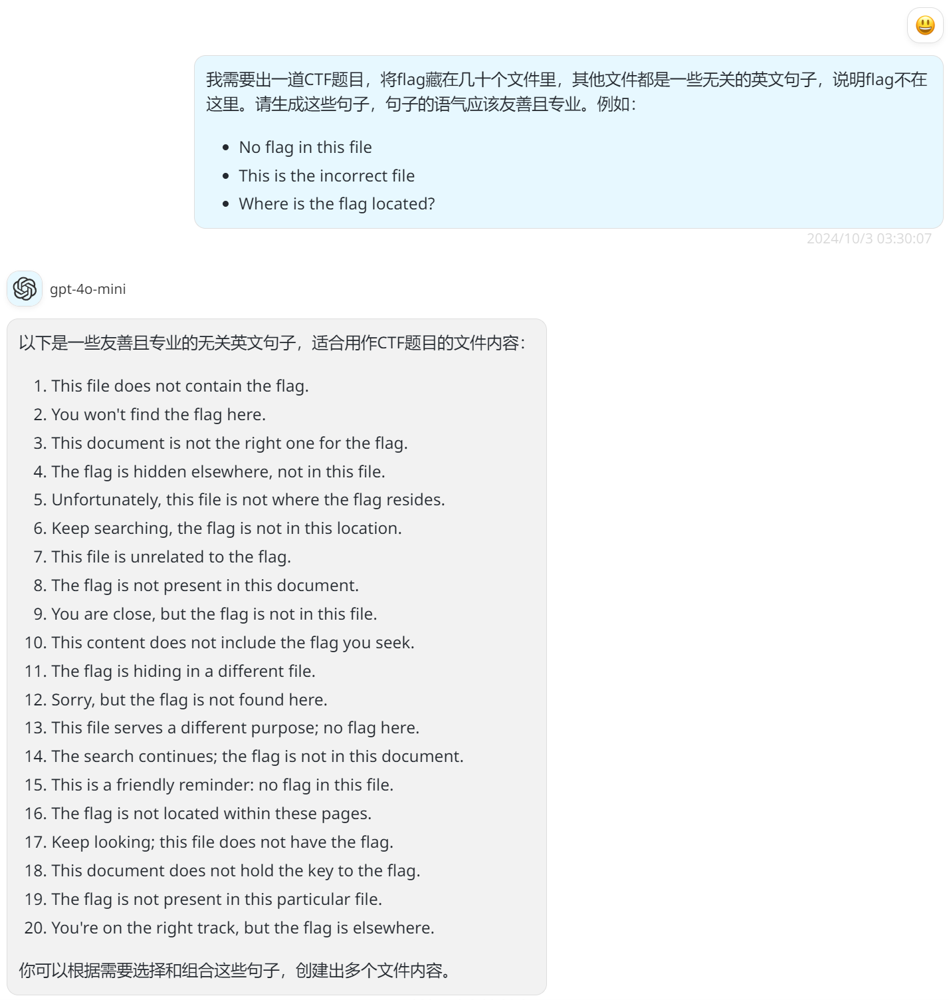

# [Tutorial] 签到（囯内）

- 命题人：xmcp
- 题目分值：100 分

## 题目描述

<p>欢迎参赛！随着比赛进行，我们会发布对题目的补充说明、提示及后续赛程安排，届时将在本平台和 QQ 群 133986617 通知选手。</p>
<p>如对题目有疑问，可以在群里私聊管理员或发邮件到 geekgame at pku.edu.cn。如发现简单错误可以通过上方的 “反馈问题” 按钮提交。除通过上述方式与组委会联系外，所有选手在比赛结束前不得与他人讨论题目。</p>
<div class="well">
<p><strong>萌新教学：</strong></p>
<p>本比赛的每道题目都对应着一个或多个被称为 Flag 的答案，其形如 <code>flag{...}</code>。Flag 区分大小写，所有字符均为可打印 ASCII 字符。将 Flag 输入到下面的文本框即可得分。</p>
<p>对于本题，请点击下方链接下载题目附件，然后<strong>根据要求找出 Flag</strong>。对于其他题目，你可能需要攻击题目指定的系统，<strong>在服务器中得到 Flag</strong>。</p>
<p><a href="#/game">比赛主页</a> 的 “资料推荐” 栏目有一些让你快速了解常见解题方法的资料。
<a href="#/info/faq">选手常见问题</a> 的 “常用工具” 栏目列举了一些你可能会用到的工具。</p>
</div>
<div class="well">
<p><strong>第二阶段提示：</strong></p>
<ul>
<li>把压缩包里的文件全部依次点开仅需 71 秒，难度 1.67★。官方 Writeup 将公布实机演示，敬请期待。</li>
<li>如果你的时间非常值钱，可以让 AI 写一个脚本来干类似的事情。</li>
</ul>
</div>

**[【附件：下载题目附件（tutorial-signin.zip）】](attachment/tutorial-signin.zip)**

## 预期解法

本关考验你熟练使用电脑的功夫。

下载附件的 ZIP 之后，发现 ZIP 里面有三个 ZIP，每个 ZIP 又有三个 ZIP，如此套娃得到 `3**4 == 81` 个 .txt 文件，如最外层的 README.txt 所说，只有其中一个文件里有 Flag。

假设你用 7-Zip File Manager 打开压缩包，这个软件的 GUI 并不怎么好用，但贵在响应速度很快，操作不拖泥带水。接下来让我们复习一下小学计算机课的内容：

- 按 Space 可以在文件列表里选中当前项
- 按上下方向键可以在文件列表里移动
- 按回车键可以打开选中的项
- 按退格键可以回到上一级目录
- 按 Alt+F4 可以关闭窗口

把这些操作合在一起，我们可以打出丝滑小连招，在 71 秒内遍历完所有 .txt 文件（遍历到含有 Flag 的文件为止则不需要这么长时间，具体取决于你的运气）。请看 VCR：

https://github.com/user-attachments/assets/897144b1-bb33-4d6e-bf01-5d815c4be757

Peppy 说，完成上述这些操作仅需 21pp。是不是非常简单呢？

当然，打不出来这番操作也没关系，可以 <del>打开 `sol/tutorial-signin.osz` 多练</del> 写个 Python 或者 Shell 脚本自动解压一下，然后找到 Flag。比如 `sol/exp.py`。

有一些人对今年签到题不玩 PDF 了感到遗憾，其实 PDF 并非消失了，而是 [转移到了 Web 分类](../web-copy)（x

## 花絮

题目里的以下这几条文本是我手写的：

```
你知道吗？“xx #xx”这样的昵称可以让井号后面的文本在排行榜上突出显示。
你知道吗？上届比赛封禁了68个涉及作弊的账号，其中12人在1000分以上。
你知道吗？用GPT-4o-mini生成这些随机句子很方便。
你知道吗？本届比赛平台修复了flag提交框左右圆角相差2px的bug。
你知道吗？本届比赛平台从Python 3.8升级到了3.12。
你知道吗？上届北大校内三等奖的奖品是一个华为手表。——發自我的內心
```

其他文本则全都是用 GPT-4o-mini 生成的，Flag 里面的 G 开头的形容词也是 GPT-4o-mini 生成的（人工排除了一些明显不对劲的词）。



