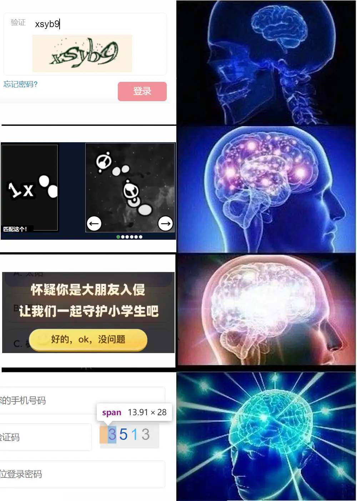

# [Web] 验证码

- 命题人：xmcp、crazyman
- Hard：150 分
- Expert：250 分

## 题目描述

    
     ↑ 图四取自某 TOP2 高校内部系统

不会吧，不会真有网站用 CSS 显示验证码吧？看我直接复制……诶，竟然<strong>不许复制？</strong>

<strong>第二阶段提示：</strong>

<ul>
<li>Flag 1：网上有很多现成的破解复制的工具。</li>
<li>Flag 2：不想写脚本解码？那就调调页面样式，然后把网页打印成 PDF。</li>
</ul>

**【网页链接：访问题目网页】**

## 预期解法

通过此题需要在60秒钟之内粘贴一段240字符（Flag 1）或2000字符（Flag 2）长的 Comic Sans 字体的验证码，正确提交即可获得 Flag。

### Flag 1

网上随便找一个能破解复制的浏览器插件，比如[这个](https://chromewebstore.google.com/detail/supreme-super-copy%E8%B6%85%E7%BA%A7%E5%A4%8D%E5%88%B6/cbfimnpbnbgjbpcnaablibnekhfghbac)：

然后就是简简单单的选中、复制、粘贴、提交一把梭。

另外，**使用 Chrome 扩展程序时需要特别注意安全，**此事在 [web-crx](../web-crx) 题目中亦有记载。比如在我出题的时候找到了[这个扩展](https://chromewebstore.google.com/detail/supercopy-%E8%B6%85%E7%BA%A7%E5%A4%8D%E5%88%B6/onepmapfbjohnegdmfhndpefjkppbjkm)：

它当时还实现得比较干净，但是在10月17日更新了0.1.15版本，里面新增了恶意脚本 `ct.bundle.js`：

目前已经向 Chrome Web Store 举报，尚未下架。顺便一提大家如果经常举报 (?) 的话，建议使用 [Chrome Web Store One Stop Support](https://support.google.com/chrome_webstore/contact/one_stop_support?hl=en) 这个面向开发者的表单。相比于商店页面里的那个跟摆设差不多的举报按钮，这个表单可以写一段小作文并确保被技术人员看到。

本题前端源码在 `src/page1.js`，可以具体看看这几种简单防复制方法的实现。

## Flag 2

此题的网页经过重磅升级，所有浏览器插件都不管用了。不要怕，我们直接按 F12 打开开发者工具……等下，按了没反应？不要怕，这说明网页劫持了键盘事件。我们只需要在外面提前按 F12，准备好之后再进入页面……等下，“有黑客”？

在页面跳转到 “有黑客” 的几百毫秒前，我们可以看到调试器里面一个断点一闪而过：

这是最近比较常见的反调试技术，在 [文心一言](https://yiyan.baidu.com/) 等网站里都有运用。大概原理是：当浏览器的开发者工具打开时，JS 执行 `debugger;` 语句会触发断点。因此 JS 代码可以周期性 `debugger;` 一下，然后检测执行前后的时间差，如果大于一个阈值则说明用户使用了开发者工具导致断点触发。

解决它的方法也很简单，我们只需点击：

然后就可以带着开发者工具正常浏览页面。在开发者工具里可以按 ctrl+shift+C 选择页面上的元素，并看看它的具体 HTML 代码。

我去，这什么玩意？

当然你可以写一段代码硬搞，不过在开发者工具里面有更优雅的做法。首先，把中间那个框的宽度和高度都改掉，使得它不需要滚动就能显示所有文字。

然后，把到处乱飘干扰视线的那堆东西隐藏掉：

最后，我们只需要按 ctrl+P 打印页面，就可以从容地在框里选中……等下，我框呢？

不要怕，这是网页为打印模式（`@media print`）增加了专门的 CSS 样式。通过开发者工具，我们可以直接强制固定为屏幕显示模式（`@media screen`）。

现在再按 ctrl+P，就可以从容复制框里面的所有文字了。这框真帅吧！

本题前端源码在 `src/page2.js`。不要被代码量吓到，事实上前 9869 行都是 [Fernet](https://www.npmjs.com/package/fernet)。只有 `// ----- XMCP: above are fernet` 以下的才是真正的源码。

## 其他解法

上面介绍了我觉得比较优雅、代码量最少的解法。但很显然，此题（尤其是 Flag2）有非常多种的其他可能解法。比如：

### 试图解码 DOM · 其一

我们直接复制整个 DOM：

或者直接把网页 ctrl+S 保存下来（注意你的浏览器版本需要[比较新](https://web.dev/articles/declarative-shadow-dom)，才能把 Shadow DOM 里面的内容也存下来）。

然后拿 Python 写个脚本把所有的 `::before` 和 `::after` 的值都计算出来，拼在一起得到验证码。这样写比较繁琐，但至少是一个思路上非常直接的做法，推荐不了解上面那个 ctrl+P 打印的套路的选手使用。虽然写脚本有点累，但至少能在合理的时间内稳定把这题过了。

### 试图解码 DOM · 其二

可以利用 `getComputedStyle` 函数直接计算出每个伪元素的文本。于是也不用 Python 硬搞了，写个 JS 获取一下就好了。

什么，你说终端上的内容总是自动清空，根本用不了？运行一下 `console.clear = ()=>{}` 就瞬间老实，或者勾上 Console 设置里的 “Preserve log” 也可以。 

需要注意所有 DOM 内容都被包在一层 Shadow DOM 里，你可以弄个油猴脚本在页面 JS 运行之前先 hook 掉 `attachShadow` 使得能拿到 Shadow DOM，也可以直接在开发者工具里（如果你能成功打开的话）点进里面的元素然后用 `$0` 变量。

### 直接逆向 JS 程序

首先**注意到**前端的巨大 JS 程序长得特别像 [obfuscator.io](https://obfuscator.io/) 混淆出来的。

然后在这个混淆器的 issue 里面可以**注意到**有人[提供了一个反混淆的工具](https://github.com/javascript-obfuscator/javascript-obfuscator/issues/1286)：

使用这个工具，可以把代码还原为相对比较能看的形式。其中可以**注意到** Flag1 的前端代码是把 HTML 里的字符串做了一些异或解密：

接下来**注意到** Flag2 的前端代码除了异或以外还有一套 Fernet 解密： 

你问我是怎么注意到的？因为我是出题人，当然知道这段代码是怎么解的密（x

于是仅需把这些逻辑都逆向出来，即可直接算出验证码。或者直接修改这段JS，让它解密完之后敲到文本框里。这样做当然是可以的，但感觉难度比预期解要高了。注意力惊人或者觉得 Web 太难的 Reverse 高手或许可以这样做（x

## 花絮

题面第四个截图取自新燕园校区的电费充值系统。这个系统现在已经亖掉了：

你说这个问题至于它亖掉吗？其实不至于，但可惜这个系统还有一堆更严重的漏洞。比如：

