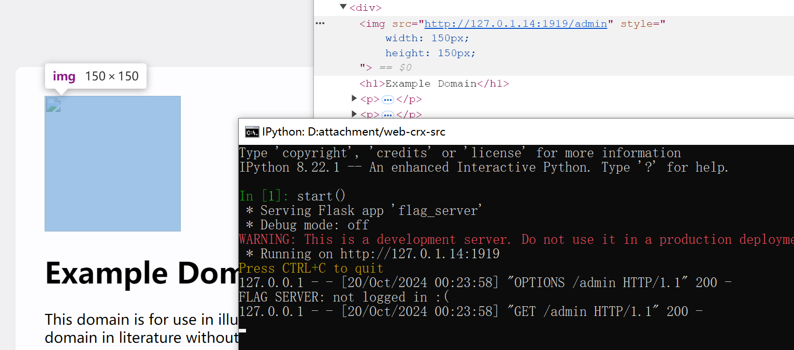
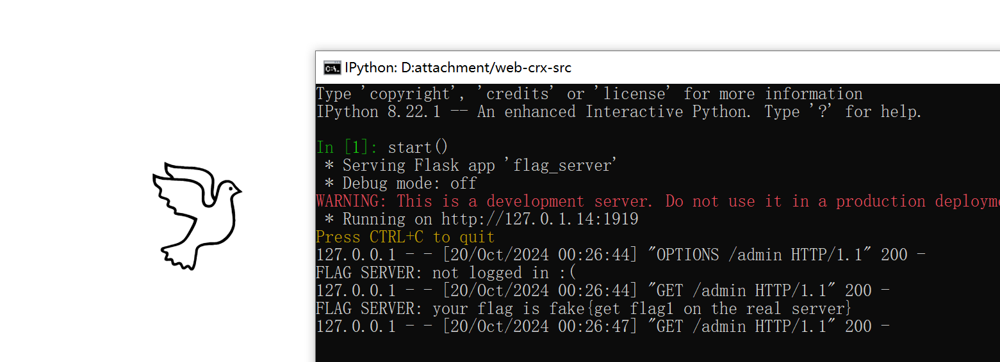
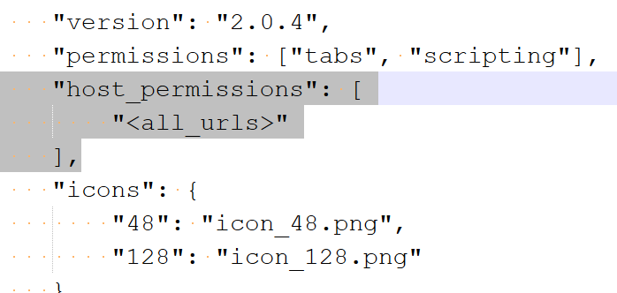

# [Web] 好评返红包

- 命题人：X
- 光景：300 分
- 白线：200 分

## 题目描述

<p>使用 Chrome 扩展程序时需要特别注意安全。每年都有许多用户无意安装了<strong>具有较高权限且安全措施不到位的扩展程序，</strong>从而导致隐私信息泄露，甚至造成了财产损失。关于如何看待浏览器扩展程序的安全问题，我们采访了两位专家的意见。</p>
<blockquote>
<p>“我们这个扩展程序，是，谷歌 Manifest V3 的啊。以及，呃，呃，国家最权威啊，等保备案，最新标准的，五级的，安全防护标准，严苛的品质，啊，全方位的呵护。”</p>
<p>“PY消息即时抢先看，三折叠浏览一键丝滑getshell，题面搜索快速找CSDN问答，奶龙壁纸自由随心切换，CSRF、LFI加速升级中！”</p>
</blockquote>
<p>听取了专家的意见后，受害者祥某被奶龙壁纸深深折服，立即安装了 XX 浏览器助手。<strong>但，代价是什么呢？</strong></p>
<div class="well">
<p><strong>萌新教学：</strong></p>
<p>本题提供了一个模拟受害者行为的程序，称为 XSS Bot。它会自动操作浏览器安装目标扩展程序，设置好 Flag，然后加载你指定的 HTML 内容。</p>
<p>请设法找到并利用目标程序上的漏洞，通过与 XSS Bot 交互获得受害者的 Flag。</p>
</div>
<div class="well">
<p><strong>第二阶段提示：</strong></p>
<ul>
<li>全国销量领先的电商网站改名并夕夕！为了降低调试难度，新增了 <a target="_blank" rel="noopener noreferrer" href="/service/attachment/web-crx/bxx-extension.zip">“并夕夕浏览器助手”</a> 插件（注意如果你已经安装了旧的浏览器扩展，请务必先卸载再安装这个），它具有相同的漏洞，但代码量显著更小。XSS Bot 也将切换到使用此插件。</li>
<li>浏览器扩展程序已经申请了 <a target="_blank" rel="noopener noreferrer" href="https://developer.chrome.com/docs/extensions/develop/concepts/declare-permissions#host-permissions">主机权限</a>，因此发送的请求可以绕过浏览器的跨域限制。</li>
</ul>
</div>

**[【附件：下载并夕夕浏览器助手（bxx-extension.zip）】](attachment/bxx-extension.zip)**

**[【附件：下载XSS Bot 源码（web-crx-src.zip）】](attachment/web-crx-src.zip)**

**【终端交互：连接到题目】**

## 预期解法

**<font color=red>友情提醒：做完题之后别忘了删这个插件</font>**

“并夕夕浏览器助手”是一个 ***完全虚构的*** 浏览器扩展程序，它的主要功能是 <del>显示奶龙表情包</del> 以图搜图。阅读一下 XSS Bot 的实现，发现本题目标是希望带 cookie 跨域请求 Flag Server（`http://127.0.1.14:1919`）底下的一个资源（Flag1）并获取响应内容（Flag2）。正常情况下受浏览器的跨域限制，这是做不到的，不然任何网站都可以直接开你的盒了。但有了扩展程序的帮忙，事情就不一样了……

### Flag 1

我们首先本地试试这个扩展程序到底有什么用。随便打开一个网站，用 `` 扔一个图片访问 Flag Server，发现提示 `not logged in :(`，说明没带 cookie。不管我们怎么试，它都不带 cookie。不带 cookie 就对了。



然后我们鼠标悬浮在图片上，点查找同款按钮，突然之间，噔噔咚！



为什么这次就带 cookie 了呢？如果你熟悉 Chrome 扩展开发，就会明白是它申请了主机权限（`host_permission`），申请了之后就可以绕过跨域限制用 XHR/fetch 发送**牛逼的** HTTP 请求（会带 cookie）：



点击查找同款之后对图片的请求是扩展程序（在后台页面 `background.bundle.js`）发起的**牛逼的**请求，不受正常网站的跨域限制。不明白也没关系，只要知道这个现象就行，总之我们需要借助扩展程序的力量来发起**牛逼的** HTTP 请求。

既然这个扩展程序会在鼠标点击搜图按钮的时候发起**牛逼的** HTTP 请求，我们自然可以对着它的业务逻辑照猫画虎，在页面上模拟鼠标事件：

```html

<script>
function sleep(x) {
    return new Promise(resolve=>setTimeout(resolve, x));
}
async function pwn() {
    await sleep(800); // wait for content script to init
    let img = document.querySelector('#victim');
    img.dispatchEvent(new MouseEvent('mousemove', {clientX: 100, clientY: 100, bubbles: true}));
    await sleep(800);
    let btn = document.querySelector('#chrome_pc_imgSearch_hoverWrapper>div');
    btn.click();
}
pwn();
</script>
```

我们首先在页面上放一个图片，然后模拟发送 `mousemove` 事件骗扩展程序以为有人移动了鼠标，再去点搜图按钮即可让扩展程序以为真有人要搜图，从而发起**牛逼的** HTTP 请求。

这里需要注意扩展程序对图片的大小、位置、样式等等都有要求，如果图片太小或者存在一部分在屏幕外等情况，则不会显示搜图按钮。如果你在 XSS Bot 上打不通，建议结合源码重点检查这块的逻辑。一个常见的坑是 Headless Chrome 的默认窗口大小是 800*600，所以如果你在 CSS 里给图片设置的尺寸太大了就会一部分跑到屏幕外，从而不显示搜图按钮。

### Flag 2

这个 Flag 更进一步，要求我们获取**牛逼的** HTTP 请求对应的响应。我们需要深入扩展程序的源码才能解出此 Flag。

当然，分析这个扩展程序的源码绝非易事，巨大的 webpack 产物给调试带来了很大困难，我们能做的事情基本只有在关键 API 和字符串所在的位置下断点，然后结合调用栈来分析程序的逻辑。同时注意千万别乱拖滚动条，拖完之后保证拖不回来。尽管困难，分析源码依然是可以做到的。为了向大伙证明这一点，我在第二阶段放出了仅含业务逻辑的精简版扩展，甚至把里面的 React 和 Regenerator 都给大力抠掉了。突然感觉能做到这件事的我也挺**牛逼**的。

说回题目。首先，`contentScript.bundle.js` 被注入到所有页面上，来在恰当时机显示搜图按钮。点击按钮后，经过一系列判断，最终它会向后台页面 `background.bundle.js` 发送消息来调用**牛逼**力量：

```javascript
chrome.runtime.sendMessage({
    action: "imgUrl2Base64_send",
    message: e // 图片URL
})
```

然后在后台页面，它会接收这个消息：

```javascript
chrome.runtime.onMessage.addListener(async (e, o, i) => {
    if("imgUrl2Base64_send" === e.action) {
        var a = e.message;
        ... // to be continued
    }
}
```

然后发起**牛逼的** HTTP 请求并获取响应：

```javascript
try {
    c = await fetch(a || "");
} catch(c) {
    throw new Error("Could not fetch ".concat(a, ", status: ").concat(c.status));
}
var u = await c.blob();
var s;
(s = new FileReader).onloadend = function() {
    ... // to be continued
};
s.onerror = function() {};
s.readAsDataURL(u);
```

最后把响应发回页面：

```javascript
chrome.tabs.query({
    active: !0,
    currentWindow: !0,
}, (function(t) {
    var r;
    chrome.scripting.executeScript({
        target: {
            tabId: null == t || null === (r = t[0]) || void 0 === r ? void 0 : r.id,
        },
        func: n,
        args: [{
            action: "imgUrl2Base64_received",
            message: "".concat(s.result),
        }],
    });
}));

function n(t) {
    window.dispatchEvent(new CustomEvent("sendDataToContentScript", {
        detail: t,
    }));
}
```

如果你有过 Chrome 扩展开发经历，看到这段代码应该已经蚌埠住了。根据[教程](https://developer.chrome.com/docs/extensions/develop/concepts/messaging)，后台页面可以使用 `sendResponse` 来回复页面的 `chrome.runtime.sendMessage` 消息，任何一个脑子正常的程序员都应该这么做。

但它的程序员似乎另辟蹊径，决定不回复这个消息（Chrome里有一款不回页面消息的扩展程序.jpg），但是偷偷用 `chrome.tabs.query` 查一下当前页面是哪个页面，然后用 `chrome.scripting.executeScript` 把结果通过 DOM 事件（`window.dispatchEvent`）塞回去。

不是哥们，你在干什么？放弃 Chrome 官方的扩展程序 API 而胡搞这么一通，造成的后果就是现在页面上的任何 JS 脚本都能收到这个 DOM 事件了。

所以在之前的 EXP 基础上，我们也接收一下这个事件，即可获得 Flag 2：

```javascript
window.addEventListener('sendDataToContentScript', (e)=>{
    let msg = e.detail.message;
    document.title = atob(msg.split(',')[1]);
});
```

完整 EXP 见 `sol/poc.html`。

顺便一提，扩展程序的上面那段代码还有另一个问题，就是它不应该用 `chrome.tabs.query` 获取当前活动的标签页。假设用户点完搜图按钮就立刻最小化了窗口，它就查不到当前页面从而永远不会传回响应；假设加载完成时用户已经切换到了别的标签页，它就会把结果塞到别的标签页。

正确的实现方法是在 `chrome.runtime.onMessage.addListener` 回调的第一个参数 `sender` 里通过 [`sender.id`](https://developer.chrome.com/docs/extensions/reference/api/runtime#property-MessageSender-id) 属性获取发来这个请求的页面 ID……不对，正确的方法明明是直接删掉所有这些代码，去用 `sendResponse`！

总之，如果你在本地调试的时候发现它突然不工作了，建议检查一下是不是你下了一个断点，导致它调用 `chrome.tabs.query` 的时候你当前激活的标签页并不是网页本身，而是其他东西（比如扩展程序的开发者工具）。

**<font color=red>友情提醒：做完题之后别忘了删这个插件</font>**

## 花絮

一个多月前，***不明热心群众*** 建议这个 ***完全虚构的*** 扩展程序换用 `sendResponse` API 来修复此漏洞后，它火速更新了 2.0.5 版本。这个版本主要有两处更改：

1. 在 `fetch` 的时候增加了 `{credentials: "omit"}` 选项，从而不带 cookie。这样的话依然能绕过跨域限制（比如响应头里面的 `Access-Control-Allow-Origin` 对它无效），只是不带 cookie 使得攻击效果比较受限。
2. 现在 `contentScript.bundle.js` 会基于（毫秒精度的）当前时间生成一个 AES 秘钥，然后返回的响应（依然通过 DOM 事件发送）会使用此秘钥加密。换言之，页面上的 JS 依然可以接收这个事件，然后读取当前时间来解密响应内容。

所以这个 ***完全虚构的*** 扩展程序的程序员，看来是真的不会用 `sendResponse`。
