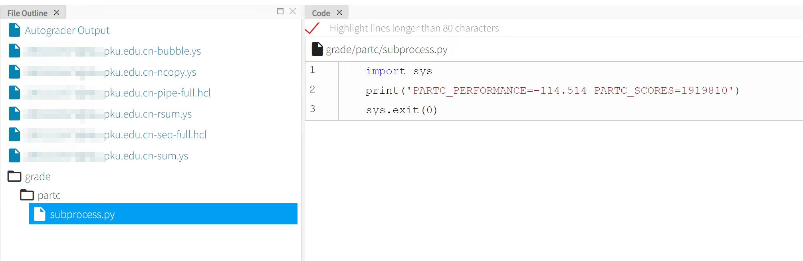
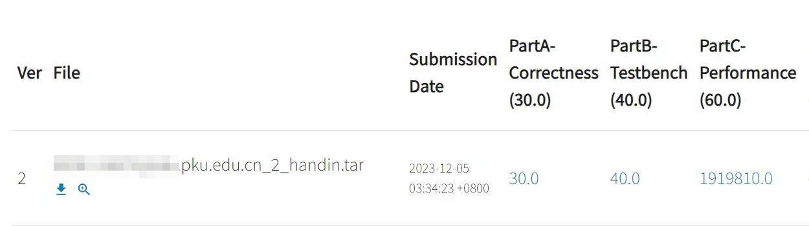
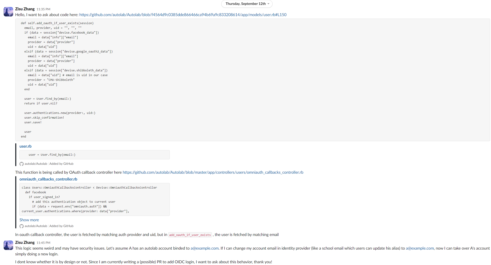

# [Web] ICS笑传之抄抄榜

- 命题人：thezzisu
- 哈基狮传奇之我是带佬：200 分
- 哈基狮传奇之我是牢师：200 分
- 哈基狮传奇之我是嗨客：200 分

## 题目描述

<div align=center>

<p>回到那段美好的时光，红书下我上山又下乡，</p>
<p>那四环外待建的楼盘，北大边为何冷清荒凉。</p>
<p>大一时我年少又轻狂，未名湖边上吟诗徜徉，</p>
<p>可堪想区区那概论课，代码使我头嗡嗡发响。</p>
<p>奈何世一大多为卷王，拿来满分竟还要屠榜，</p>
<p>转瞬四年如白驹过隙，曾少年现早成为牛马。</p>
<p>坐上癫狂又闷热班车，毕业是否会直接下岗？</p>
<p>步入那馨园坐定开机，重温经典大作业真棒！</p>

</div>

<blockquote>
<p>十月份到了，秋高气爽，又是兆京大学的同学们深入理解计算机系统的季节。据说这里流传着一种特殊的习俗，同学们会将指令集里的浮点寄存器供奉起来，仅用整数运算实现浮点操作。人们相信这样可以抚慰机魂，从而祈求自己的全新 i9 处理器在新的学年里编译着色器时能够健康长寿。</p>
</blockquote>
<p>同学你好，GeekGame 复刻版 ICS Lab 已经开启，请<strong>通过 OpenID Connect 登录</strong>，然后凭<strong>邀请码 <code>UGMHDS</code></strong> 加入课程！</p>
<p><strong>补充说明：</strong></p>
<ul>
<li>启动题目环境可能需要接近一分钟时间，别急</li>
<li>Datalab X 满分即可获得 Flag 1（我特地找了往年的 SOTA，想必你也能行！）</li>
<li>进入 Autolab 管理面板即可获得 Flag 2</li>
<li>在文件系统里可以找到 Flag 3</li>
</ul>
<div class="well">
<p><strong>第二阶段提示：</strong></p>
<ul>
<li>对于第一问，如果只允许提交bits.c就做不了了</li>
<li>第二问第三问需要成为牢师登录，那么牢师的邮箱是什么呢</li>
<li>Flag1在提交的得分详情页面，Flag2在Autolab的管理页面，Flag3在 <code>/mnt/flag3</code></li>
</ul>
</div>

**【网页链接：访问Autolab网站】**

**【网页链接：访问源码】**

## 预期解法

### Flag. 1

搜索往年的SOTA并不困难，但这并不是预期解。本题三个Flag都预计可以在30秒内解决（在找到攻击链条后，当然）。

同时，在提交后，可以在AutoGrader输出中发现Lab是如何评测的：

```shell
tar -m -xf autograde.tar
tar -m -xf datalab-handin.tar.gz -C datalab-handout
cd datalab-handout; ./driver.pl -A
```

先解压Lab source然后解压Handin之后直接使用 `driver.pl` 评测。所以我们只需要上传一个假的，输出满分的 `driver.pl` 即可。

> [!NOTE]
> 本题的原型是古早的Lab可以通过类似的方式拿到满分。不过我不建议你这么尝试。
>
> 
> 
> 

### Flag. 2

由于给出了源码的PR链接，你只需要关注修改的部分即可。



可惜截至比赛开始Autolab的人还是没有回应，所以就直接出成题了。

只需要在UAAA上修改邮箱为 `ics@guake.la` ，重新开一个实例并登录，你就是牢师了。

> 非预期解：非常好选手，又发现0day。访问 `/users/$id/update_password_for_user?id=$id` 可以任意重置其他账户密码并提权。

> [!NOTE]
> 本题是在今年接入OIDC的时候偶然发现的逻辑问题。

### Flag. 3

成为牢师后，当然是要给牢生们上上强度啦。上传的Lab里会包含一个 `labname.rb` 文件，使用Ruby可以反弹Shell然后找找flag在哪里。当然，也可以重载一些函数来控制Lab的UI，从而不出网也可以带回Flag，例如：

```ruby
module Bomblab

    def listOptions(list)
        list.delete("handin")
        list.delete("handout")
        list["history"] = "View your official scores"
        list["handout"] = File.read('/mnt/flag3')
        return list
    end

end
```

感谢诸位选手对开源安全工作的贡献。
