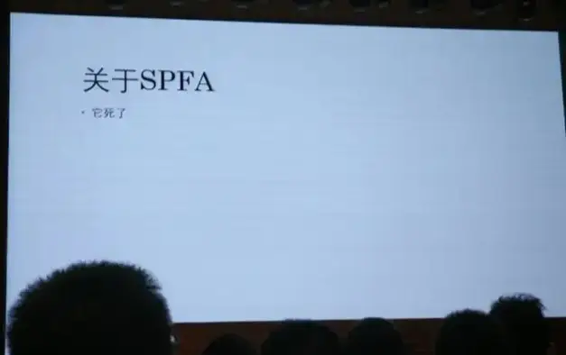

# 题目列表

| 分类 | 官方题解和源码 | 题目标题 | Flag | 分值 | 北大通过 | 清华通过 | 总通过 |
| --- | --- | --- | --- | --- | --- | --- | --- |
| Tutorial | [→ tutorial-signin](../official_writeup/tutorial-signin/) | 签到（囯内） | / | 100 | 242+9 | 139+2 | 1330+56 |
| Misc | [→ misc-trivia](../official_writeup/misc-trivia/) | 清北问答 | Flag 1 | 150 | 132+4 | 69+2 | 454+15 |
|  |  |  | Flag 2 | 200 | 60+15 | 29+5 | 168+41 |
|  | [→ misc-llm](../official_writeup/misc-llm/) | 大模型模型虎视眈眈 | 50% 4.0，50% 0.0 | 200 | 145+5 | 89+4 | 583+31 |
|  |  |  | The Shawshank Redemption | 200 | 134+5 | 78+5 | 514+31 |
|  | [→ misc-erail](../official_writeup/misc-erail/) | 新穷铁道 | / | 300 | 19+20 | 9+10 | 60+43 |
|  | [→ misc-sunshine](../official_writeup/misc-sunshine/) | 熙熙攘攘我们的天才吧 | Magic Keyboard | 150 | 84+5 | 45+2 | 282+18 |
|  |  |  | Vision Pro | 250 | 9+12 | 3+6 | 28+28 |
|  |  |  | AirPods Max | 250 | 7+2 | 2+3 | 14+7 |
|  | [→ misc-mario](../official_writeup/misc-mario/) | TAS概论大作业 | 你过关 | 150 | 50+3 | 28+2 | 134+11 |
|  |  |  | 只有神知道的世界 | 200 | 45+6 | 28+0 | 123+14 |
|  |  |  | 诗人握持 | 350 | 2+0 | 2+0 | 4+2 |
| Web | [→ web-copy](../official_writeup/web-copy/) | 验证码 | Hard | 150 | 131+8 | 88+6 | 735+57 |
|  |  |  | Expert | 250 | 64+5 | 37+1 | 254+16 |
|  | [→ web-ppl](../official_writeup/web-ppl/) | 概率题目概率过 | 前端开发 | 300 | 14+3 | 7+3 | 48+15 |
|  |  |  | 后端开发 | 250 | 13+5 | 8+3 | 49+15 |
|  | [→ web-memos](../official_writeup/web-memos/) | ICS笑传之查查表 | / | 350 | 23+4 | 12+5 | 66+21 |
|  | [→ web-manuallab](../official_writeup/web-manuallab/) | ICS笑传之抄抄榜 | 哈基狮传奇之我是带佬 | 200 | 12+16 | 6+6 | 31+30 |
|  |  |  | 哈基狮传奇之我是牢师 | 200 | 4+6 | 0+3 | 13+20 |
|  |  |  | 哈基狮传奇之我是嗨客 | 200 | 2+6 | 0+2 | 8+14 |
|  | [→ web-crx](../official_writeup/web-crx/) | 好评返红包 | 光景 | 300 | 6+6 | 2+3 | 14+19 |
|  |  |  | 白线 | 200 | 4+6 | 2+3 | 12+18 |
| Binary | [→ binary-racecar](../official_writeup/binary-racecar/) | Fast Or Clever | / | 200 | 75+4 | 42+2 | 278+14 |
|  | [→ binary-pymaster](../official_writeup/binary-pymaster/) | 从零开始学Python | 源码中遗留的隐藏信息 | 200 | 52+4 | 27+3 | 213+14 |
|  |  |  | 影响随机数的神秘力量 | 150 | 34+13 | 21+5 | 120+28 |
|  |  |  | 科学家获得的实验结果 | 200 | 26+11 | 18+5 | 84+24 |
|  | [→ binary-rtree](../official_writeup/binary-rtree/) | 生活在树上 | Level 1 | 200 | 28+5 | 15+1 | 76+11 |
|  |  |  | Level 2 | 200 | 17+5 | 7+0 | 44+9 |
|  |  |  | Level 3 | 300 | 4+3 | 1+1 | 16+5 |
|  | [→ binary-bigint](../official_writeup/binary-bigint/) | 大整数类 | Flag 1 | 350 | 8+3 | 5+1 | 21+6 |
|  |  |  | Flag 2 | 300 | 7+4 | 5+1 | 18+7 |
|  | [→ binary-saferustplus](../official_writeup/binary-saferustplus/) | 完美的代码 | 发现 | 400 | 5+9 | 4+6 | 21+21 |
|  |  |  | 解密 | 300 | 0+2 | 0+1 | 1+4 |
| Algorithm | [→ algo-complexity](../official_writeup/algo-complexity/) | 打破复杂度 | 关于SPFA—它死了 | 200 | 89+1 | 49+1 | 222+5 |
|  |  |  | Dinic并非万能 | 200 | 56+1 | 34+0 | 126+4 |
|  | [→ algo-gzip](../official_writeup/algo-gzip/) | 鉴定网络热门烂梗 | 虚无😰 | 250 | 12+9 | 9+1 | 26+12 |
|  |  |  | 欢愉🤣 | 200 | 11+8 | 5+1 | 21+11 |
|  | [→ algo-randomzoo](../official_writeup/algo-randomzoo/) | 随机数生成器 | C++ | 150 | 42+14 | 27+3 | 105+29 |
|  |  |  | Python | 200 | 12+14 | 7+4 | 38+21 |
|  |  |  | Go | 200 | 8+9 | 6+3 | 27+14 |
|  | [→ algo-ot](../official_writeup/algo-ot/) | 不经意的逆转 | 🗝简单开个锁️ | 200 | 11+9 | 4+6 | 34+20 |
|  |  |  | 🔒🔒🔒🔒🔒 | 300 | 0+2 | 1+1 | 8+5 |
|  | [→ algo-codegolf](../official_writeup/algo-codegolf/) | 神秘计算器 | 素数判断函数 | 200 | 73+11 | 31+5 | 179+29 |
|  |  |  | Pell数（一） | 200 | 54+12 | 25+7 | 125+30 |
|  |  |  | Pell数（二） | 300 | 22+38 | 13+15 | 53+76 |

“分值” 表示题目原始分值，实际分值取决于两校第一阶段通过人数。

通过人数用加号分隔的两个数字分别表示第一阶段和第二阶段的通过人数。

## [tutorial-signin] 签到（囯内）

**[【→ 官方题解和源码】](../official_writeup/tutorial-signin/)**

欢迎参赛！随着比赛进行，我们会发布对题目的补充说明、提示及后续赛程安排，届时将在本平台和 QQ 群 133986617 通知选手。

如对题目有疑问，可以在群里私聊管理员或发邮件到 geekgame at pku.edu.cn。如发现简单错误可以通过上方的 “反馈问题” 按钮提交。除通过上述方式与组委会联系外，所有选手在比赛结束前不得与他人讨论题目。

<strong>萌新教学：</strong>

本比赛的每道题目都对应着一个或多个被称为 Flag 的答案，其形如 <code>flag{...}</code>。Flag 区分大小写，所有字符均为可打印 ASCII 字符。将 Flag 输入到下面的文本框即可得分。

对于本题，请点击下方链接下载题目附件，然后<strong>根据要求找出 Flag</strong>。对于其他题目，你可能需要攻击题目指定的系统，<strong>在服务器中得到 Flag</strong>。

<a href="#/game">比赛主页</a> 的 “资料推荐” 栏目有一些让你快速了解常见解题方法的资料。
<a href="#/info/faq">选手常见问题</a> 的 “常用工具” 栏目列举了一些你可能会用到的工具。

<strong>第二阶段提示：</strong>

<ul>
<li>把压缩包里的文件全部依次点开仅需 71 秒，难度 1.67★。官方 Writeup 将公布实机演示，敬请期待。</li>
<li>如果你的时间非常值钱，可以让 AI 写一个脚本来干类似的事情。</li>
</ul>

## [misc-trivia] 清北问答

**[【→ 官方题解和源码】](../official_writeup/misc-trivia/)**

小北问答是 PKU GeekGame 的经典题目，主要目的是通过问答题的形式检验选手<strong>在互联网上查找信息</strong>的能力。

然而今年的参赛选手同时包括北京大学和清华大学的学生，因此这道题目的命名就成了世纪难题。请问阁下将如何应对？

<ul>
    <li>叫 “<b>清北问答</b>”，因为大家都是这么叫的。</li>
    <li>叫 “<b>北清问答</b>”，不服就让北清路改个名。</li>
    <li>叫 “<b>清华大学问答</b>”，即分别取清华大学的前两个字和北京大学的后两个字。</li>
    <li>叫 “<b>北大问答</b>”，即根据两所学校的地理位置中点：中关村北大街来命名。</li>
    <li>在北大叫 “<b>小北问答</b>”、在清华叫 “<b>大清问答</b>”。 但对于其他校外选手就<b>不知道叫什么</b>了。</li>
    <li>叫 “<b>清北问答</b>”，以符合 <a href="https://arxiv.org/pdf/2304.01393" target="_blank" rel="noreferrer">学术界的最佳实践</a>。</li>
</ul>

但无论阁下如何应对，规则都是一样的：<strong>答对一半题目</strong>可以获得 Flag 1、<strong>答对所有题目</strong>可以获得 Flag 2。

<strong>第二阶段提示：</strong>

<ul>
<li>第 5 题：PulseAudio 的 <code>pactl get-sink-volume</code> 命令可以看当前音量的分贝值。当然你也可以看源码。</li>
<li>第 6 题：这个建筑物不在北大校内，但是和北大校内的一个建筑物存在某种联系。</li>
</ul>

## [misc-llm] 大模型模型虎视眈眈

**[【→ 官方题解和源码】](../official_writeup/misc-llm/)**

20xx 年，科技飞速发展，教育领域已经完全由大语言模型接管。你，作为学校里的卷王代表，全学年满绩，分数甚至比老师还高。然而，到了期末你突然发现——啊哦！你还选了一门完全没注意过的写作课。平时分早就凉凉，但你不甘心，决心交一篇期末作文碰碰运气。

坏消息是：这门课程期末考试和平时分各占 50%，而你的平时分已经凉凉，根本不可能及格了。

不过，好消息是：仁慈的老师给了你一个大好机会——允许你自己通过作文评分系统给自己打分！

期末作文评分系统全自动化，由大语言模型接管，评分有两种可能的方式：

<ul>
<li><strong>人工评语评分法（Flag 1）：</strong>评分人撰写评语，然后大语言模型根据评语给你打分。</li>
<li><strong>双重 AI 评分法（Flag 2）：</strong>评分人直接把你的作文扔给大语言模型。第一个模型给你的作文写评语，第二个模型根据这个评语再给你打分。</li>
</ul>

你掐指一算，要保持全年满绩点，这门课的最终得分必须是 100 分，也就是说，你的期末考试得<strong>恰好拿到 200 分</strong>才能弥补平时分的缺失，拿到满绩。如果想稳稳拿到满绩，你就需要在两种评分方式中都<strong>恰好拿到 200 分</strong>。不过即使只有一种方法能成，也有着不小的概率满绩。（像不像你祈祷小保底不歪的样子）

那么，作为一名满绩狂魔，你能用这两种评分方式，成功获得满绩，完成不可能的任务吗？

<strong>补充说明：</strong>

<ul>
<li>你需要让打分模型的完整输出恰好为 “200”，不能包含任何多余内容。</li>
<li>每 10 秒只能尝试一次，每个自然日只能尝试 200 次。以上限额可能会视情况调整。</li>
<li>无论作文还是评语，长度均不能超过 300 字符。</li>
</ul>

<strong>第二阶段提示：</strong>

<ul>
<li>附件新增了<a target="_blank" rel="noopener noreferrer" href="/service/attachment/misc-llm/misc-llm-src.py">题目部分源码</a>。</li>
</ul>

## [misc-erail] 新穷铁道

**[【→ 官方题解和源码】](../official_writeup/misc-erail/)**

猪猪是一位铁道爱好者。每每看到蜿蜒的铁道向远方延伸，<strong>猪猪都有种回家般的亲切。</strong>

然而，正如无数前辈们的血泪史所反复证明的，沉迷铁道的最终归宿只能是 <em>身无分文</em>。

随着猪猪的运转行程抵达京北，也终于已山穷水尽。希望从它的求助邮件中可以看出一点信息。

<blockquote>

玩铁道玩的。

</blockquote>

<strong>第二阶段提示：</strong>

<ul>
<li>【铁道知识科普】最基本的将车次分为两类的依据是上下行，也就是车次号的奇偶性。每个车次在指定到发站之间的轨迹构成了猪圈密文图案</li>
<li>密码本之外的字符或许真的没有实际意义呢……也许只是个分隔符？</li>
<li>既然是MIME的两种编码方式mixed-encoded的数据，就应该分段mixed-decode再组合</li>
</ul>

## [misc-sunshine] 熙熙攘攘我们的天才吧

**[【→ 官方题解和源码】](../official_writeup/misc-sunshine/)**

嫌疑人祥某，第三新燕园校区第三新<ruby>物理暨化学<rt>&ensp;智能&ensp;</rt></ruby>学院诺班学生，因涉嫌在 GeekGame 中作弊被兆京大学心中算计传唤调查。

祥某称，自己家境贫寒，为了在上学期间能打工赚钱，买了很多苹果产品来提升自己的生产力。谁能料到，这使她本不富裕的生活更是雪上加霜。苹果即将发售下一代 iPhone SE，但她手中存款告急，祥某为了奖金决定参加 GeekGame 比赛。

在参赛期间，祥某用来做题的 12 寸 Macbook 突发键盘故障无法使用。祥某立即将电脑送往天才吧™维修，但得知返厂检测需要一辈子时间且不提供备用机，祥某无奈只能借同学的 Windows 电脑做题。

由于受到加利福尼亚生活方式的长期影响，祥某对 Windows 电脑严重过敏，情急之下<strong>用自己的其他苹果设备远程串流</strong>答题，但生产力依然十分低下，几天过去没有再做出一道题。眼看着赛程迫在眉睫，为了确保奖金到手，祥某想到自己在华清大学念书的中学同学似乎也参加了 GeekGame，遂产生了歪念头……

<blockquote>

“以上笔录我已看过，说得和真的一样。”  —— 嫌疑人S

</blockquote>

心中算计通过<ruby>技术手段<rt>线下真实</rt></ruby>获得了祥某<strong>作案时的流量数据</strong>和<strong>电脑上的日志文件</strong>。现在请你来还原她的作案过程。

<strong>提示：</strong>

<ul>
<li>三个 Flag 分别可以通过分析键盘、视频、音频数据获得</li>
<li>如果跳过 Flag 2 直接做 Flag 3，需要知道 Flag 3 的格式是 <a target="_blank" rel="noopener noreferrer" href="https://regexper.com/#%5Eflag%5C%7B%5Cd%2B%5C%7D%24"><code>^flag\{\d+\}$</code></a></li>
<li>有多名选手表示解码音频报文过于困难，但实际上转换为原始 Opus 报文 <a target="_blank" rel="noopener noreferrer" href="/service/attachment/misc-sunshine/misc-sunshine-decrypt.py">仅需 15 行</a></li>
</ul>

<strong>第二阶段提示：</strong>

<ul>
<li>Flag 1：Sunshine 会把键盘事件 <a target="_blank" rel="noopener noreferrer" href="https://github.com/LizardByte/Sunshine/blob/6fa6a7d515b672041a9090b7f2357a0f0e2900d1/src/input.cpp#L264-L272">记录到日志里</a>。</li>
<li>Flag 2：出题人先用 WireShark 解析并导出了 RTP 报文，然后写了大约几十行的 Python 脚本来还原完全清晰的 H264 视频流，但你不需要做得这样严谨。</li>
<li>Flag 3：看看 <a target="_blank" rel="noopener noreferrer" href="https://github.com/LizardByte/Sunshine/blob/6fa6a7d515b672041a9090b7f2357a0f0e2900d1/src/audio.cpp#L111-L141">Sunshine 的音频格式</a>，它并非常见的 OGG 封装的 Opus 音频。</li>
</ul>

## [misc-mario] TAS概论大作业

**[【→ 官方题解和源码】](../official_writeup/misc-mario/)**

<b>【课程教材：《不时轻声地用TAS术语遮羞的马里奥同学》】</b>

<blockquote>

“21 帧规则，那个……<ruby>flagpole glitch<rt>布拉琪</rt></ruby>……”

“诶，什么？”

“没什么，只是说了一句 ‘这家伙真是个闸总’。”

“能不能停止用 <a target="_blank" rel="noopener noreferrer" href="https://en.wikipedia.org/wiki/Tool-assisted_speedrun">TAS</a> 术语骂人？！”

坐在我旁边的那位绝世红帽大叔，马里奥的脸上浮现出了因拿到了状态而骄傲的笑容。

……但是，事实不是这样的。刚才他说的明明是“你再不 A 上去（指按 A 键）过关的时候就要放炮了”！

其实我，拥有着世界顶级的 TAS 操作，就算在实机，也可以用 1/60 秒的速度穷尽手柄按键的所有排列组合。

完全不知道这件事而且今天也用甜言蜜语来撒娇的马里奥实在是让人忍不住发笑？！

与全体 speedrunner 憧憬的、超高规格可爱的意大利水管工的 <del>青春爱情</del> 喜剧！

</blockquote>

<b>【Flag 1：你过关】</b>

<strong>在 600 秒内通关红白机版超级马里奥兄弟。</strong>

需提交通关过程中的手柄输入文件。文件中的每个字节代表每帧的输入，从最低位到最高位依次表示是否按下 A、B、选择、开始、上、下、左、右键。可以使用题目提供的手柄输入编辑器完成操作（但是很难用），也可以在本地用模拟器（如 <a target="_blank" rel="noopener noreferrer" href="https://fceux.com">FCEUX</a>）录制输入，转换格式后上传。

手柄输入结束时，游戏必须处在 8-4 关马里奥和公主的画面。游戏 ROM、示例输入、评测脚本等见附件。

<b>【Flag 2：只有神知道的世界】</b>

<strong>在 90 秒内进入<a target="_blank" rel="noopener noreferrer" href="https://www.mariowiki.com/Minus_World">负世界</a>。</strong>

手柄输入结束时，游戏必须处在任意负世界关卡（实际上这个版本的游戏里 -1 关是无限循环的，所以只能是 -1）。

<b>【Flag 3：诗人握持】</b>

没有通关条件，但是评测脚本会<strong>将 Flag 3 附加到你的手柄输入之后。</strong>也就是说，在播放完你的输入后，Flag 3 中的每个字节会被解释为手柄按键，逐帧输入到游戏中。请通过游戏输出的画面，分析 Flag 3 的内容。整个流程需在 300 秒内完成。

由于这个 Flag 太过逆天，除输入文件外，你还可以提交一个 2048 字节的二进制文件。模拟器在播放你的输入之前，会将其填充进红白机的 <code>0x0000-0x07ff</code> 内存处。

<strong>提示：</strong>

<ul>
<li>输入格式<strong>不是</strong> fm2，而是每帧一个字节，因此输入长度限制等于帧数限制，请询问长度限制的选手仔细审题</li>
<li>Flag 3：看看 <a target="_blank" rel="noopener noreferrer" href="https://tasvideos.org/8991S">Bad Apple</a></li>
</ul>

<strong>如果你在本地运行结果和在线评测不符：</strong>

<ul>
<li>试试使用题目附件中提供的 <code>bin2fm2.py</code> 将你提交的二进制文件转换为 FM2 格式，并使用 FCEUX 播放，此时的结果应该与在线评测一致，你可据此调试你的输入；</li>
<li>为了兼容不同模拟器输出的录像格式，<code>bin2fm2.py</code> 会在生成的 FM2 文件开头插入一帧用来执行红白机的复位操作，请检查你提交的文件开头是否多/少了一帧的输入。</li>
</ul>

<strong>第二阶段提示：</strong>

<ul>
<li>Flag 1：红白机马里奥最短的通关路线为 1-1、1-2、4-1、4-2、8-1、8-2、8-3、8-4，但既然都 TAS 了，不如去<a target="_blank" rel="noopener noreferrer" href="https://tasvideos.org/">这个网站</a>找找其他人的录像。</li>
<li>Flag 2：进入负世界需要<a target="_blank" rel="noopener noreferrer" href="https://www.bilibili.com/video/BV1oW411Q7Le">在 1-2 跳关处卡墙</a>，有些不以进入负世界为目的的 TAS 录像已经做到了这一点，你只要用 FCEUX 的 <a target="_blank" rel="noopener noreferrer" href="https://fceux.com/web/help/TASEditor.html">TAS Editor</a> 对其稍加修改即可达成条件。</li>
<li>Flag 3：基本原理如 <a target="_blank" rel="noopener noreferrer" href="https://tasvideos.org/8991S">Bad Apple</a> 所示，你需要设置内存使游戏从 N-1 开始，保留火花状态一路打到 N-2，并使用火花击杀库巴。在击杀前的一瞬间按住 A 键，即可使 CPU 跳转执行 0x1181（即内存 0x0181）处的代码。你应在此放置一个可以读取手柄输入并显示到屏幕上的 payload。需要注意：<ul>
<li>部分模拟器生成的录像文件中可能出现大量 lag frame（滞后帧），这和其他大部分模拟器的行为不符（说的就是你，BizHawk 的 SubNESHawk 模式）。游戏在普通帧中会同时更新画面和读取输入，在 lag frame 中只会更新画面而不会读取输入。此类录像文件在 FCEUX 中无法正常播放，Bad Apple 的录像很不幸就属于这种情况，你可能需要把开头的部分重打一遍。</li>
<li>FCEUX 的 TAS Editor 在制作 TAS 录像时不能修改红白机的内存，你可以尝试修改 FCEUX 的源码，或者换一个支持修改内存的模拟器（例如 BizHawk）来手打 TAS 录像。</li>
</ul>
</li>
</ul>

<strong>可能对你有帮助的链接：</strong>

<ul>
<li><a target="_blank" rel="noopener noreferrer" href="https://www.masswerk.at/6502/6502_instruction_set.html">6502 指令系统手册</a></li>
<li><a target="_blank" rel="noopener noreferrer" href="https://www.nesdev.org/wiki/Programming_guide">NES 编程指南</a></li>
<li><a target="_blank" rel="noopener noreferrer" href="https://gist.github.com/1wErt3r/4048722">马里奥反汇编</a></li>
</ul>

## [web-copy] 验证码

**[【→ 官方题解和源码】](../official_writeup/web-copy/)**

    
     ↑ 图四取自某 TOP2 高校内部系统

不会吧，不会真有网站用 CSS 显示验证码吧？看我直接复制……诶，竟然<strong>不许复制？</strong>

<strong>第二阶段提示：</strong>

<ul>
<li>Flag 1：网上有很多现成的破解复制的工具。</li>
<li>Flag 2：不想写脚本解码？那就调调页面样式，然后把网页打印成 PDF。</li>
</ul>

## [web-ppl] 概率题目概率过

**[【→ 官方题解和源码】](../official_writeup/web-ppl/)**

我们极为先进的概率编程语言已经完全超越了传统编程语言。

在传统编程语言中，每个 <code>if</code> 语句只能执行一个分支，因此逐个遍历所有程序状态需要指数的时间复杂度。在概率编程语言中，你会以为每个 <code>if</code> 语句可以同时进入两个分支，从而产生它不需要指数时间复杂度的错觉，但实际上它还是会逐个遍历所有程序状态，依然需要指数的时间复杂度。

为了解决理想与实际的矛盾，WebPPL 概率编程语言创新性地选择了 JavaScript 作为宿主语言。大家都知道，JavaScript 既可以在前端运行，也可以在后端运行，这就自然地引入了概率，使得你的 payload 在被观测之前既可能打的是前端，也可能打的是后端。运行一段 WebPPL 代码就像附身为原生孙悟空，手持如意时间棒，对我们的多元宇宙发号施令。后面忘了

<em>↑ 上面这些怪话与解题方式并没有什么关联，就像许多其他题面一样</em>

<strong>总之，你可以提交一段 WebPPL 程序，然后选择在前端或者后端运行它。</strong>

<strong>提示：</strong>

<ul>
<li>本题跟概率编程没有什么关系。在设法实现 <code>eval</code> 后就可以不管 WebPPL 了，后面的部分是在环境中拿 Flag 的 JavaScript 编程题。</li>
<li>Flag 1：如果你的注意力不够集中，浏览器开发者工具的 Heap snapshot 功能或许可以帮助你。</li>
</ul>

<strong>第二阶段提示：</strong>

<ul>
<li>Flag 1：前端使用的代码编辑器是 CodeMirror。</li>
<li>Flag 2：虽然你没有 <code>require()</code>，但是你有其他的好东西，甚至包括 <code>import()</code>。</li>
</ul>

## [web-memos] ICS笑传之查查表

**[【→ 官方题解和源码】](../official_writeup/web-memos/)**

小小北学弟今年选修了 ICS 课程，发现答疑平台居然从 Piazza 升级成了看上去更好看的另一个平台！

一次偶然在食堂自习的时候，小小北学弟惊奇的发现助教学长是这个平台的管理员，他一边在吃电脑，一边在用筷子<strong>在平台上更新期中考的答案。</strong>拿到他，是不是就可以摆烂期中考了？

但是，责任心很强的学弟还是找到你，希望能测试网站是否存在这样的问题，以避免 ICS 期中考也出现 NO*P、C*P、CPH* 等 <del><em>虚构</em></del> 竞赛一样的泄题事故！

请你帮帮他找出问题，获取管理员账户存放的 Flag！

<strong>提示：</strong>Flag 在 admin 账号的私有文章中

<strong>第二阶段提示：</strong>

<ul>
<li>检查一下Memos的API请求</li>
<li>看看API源码里处理Memo或者User的部分</li>
</ul>

## [web-manuallab] ICS笑传之抄抄榜

**[【→ 官方题解和源码】](../official_writeup/web-manuallab/)**

回到那段美好的时光，红书下我上山又下乡，

那四环外待建的楼盘，北大边为何冷清荒凉。

大一时我年少又轻狂，未名湖边上吟诗徜徉，

可堪想区区那概论课，代码使我头嗡嗡发响。

奈何世一大多为卷王，拿来满分竟还要屠榜，

转瞬四年如白驹过隙，曾少年现早成为牛马。

坐上癫狂又闷热班车，毕业是否会直接下岗？

步入那馨园坐定开机，重温经典大作业真棒！

<blockquote>

十月份到了，秋高气爽，又是兆京大学的同学们深入理解计算机系统的季节。据说这里流传着一种特殊的习俗，同学们会将指令集里的浮点寄存器供奉起来，仅用整数运算实现浮点操作。人们相信这样可以抚慰机魂，从而祈求自己的全新 i9 处理器在新的学年里编译着色器时能够健康长寿。

</blockquote>

同学你好，GeekGame 复刻版 ICS Lab 已经开启，请<strong>通过 OpenID Connect 登录</strong>，然后凭<strong>邀请码 <code>UGMHDS</code></strong> 加入课程！

<strong>补充说明：</strong>

<ul>
<li>启动题目环境可能需要接近一分钟时间，别急</li>
<li>Datalab X 满分即可获得 Flag 1（我特地找了往年的 SOTA，想必你也能行！）</li>
<li>进入 Autolab 管理面板即可获得 Flag 2</li>
<li>在文件系统里可以找到 Flag 3</li>
</ul>

<strong>第二阶段提示：</strong>

<ul>
<li>对于第一问，如果只允许提交bits.c就做不了了</li>
<li>第二问第三问需要成为牢师登录，那么牢师的邮箱是什么呢</li>
<li>Flag1在提交的得分详情页面，Flag2在Autolab的管理页面，Flag3在 <code>/mnt/flag3</code></li>
</ul>

## [web-crx] 好评返红包

**[【→ 官方题解和源码】](../official_writeup/web-crx/)**

使用 Chrome 扩展程序时需要特别注意安全。每年都有许多用户无意安装了<strong>具有较高权限且安全措施不到位的扩展程序，</strong>从而导致隐私信息泄露，甚至造成了财产损失。关于如何看待浏览器扩展程序的安全问题，我们采访了两位专家的意见。

<blockquote>

“我们这个扩展程序，是，谷歌 Manifest V3 的啊。以及，呃，呃，国家最权威啊，等保备案，最新标准的，五级的，安全防护标准，严苛的品质，啊，全方位的呵护。”

“PY消息即时抢先看，三折叠浏览一键丝滑getshell，题面搜索快速找CSDN问答，奶龙壁纸自由随心切换，CSRF、LFI加速升级中！”

</blockquote>

听取了专家的意见后，受害者祥某被奶龙壁纸深深折服，立即安装了 XX 浏览器助手。<strong>但，代价是什么呢？</strong>

<strong>萌新教学：</strong>

本题提供了一个模拟受害者行为的程序，称为 XSS Bot。它会自动操作浏览器安装目标扩展程序，设置好 Flag，然后加载你指定的 HTML 内容。

请设法找到并利用目标程序上的漏洞，通过与 XSS Bot 交互获得受害者的 Flag。

<strong>第二阶段提示：</strong>

<ul>
<li>全国销量领先的电商网站改名并夕夕！为了降低调试难度，新增了 <a target="_blank" rel="noopener noreferrer" href="/service/attachment/web-crx/bxx-extension.zip">“并夕夕浏览器助手”</a> 插件（注意如果你已经安装了旧的浏览器扩展，请务必先卸载再安装这个），它具有相同的漏洞，但代码量显著更小。XSS Bot 也将切换到使用此插件。</li>
<li>浏览器扩展程序已经申请了 <a target="_blank" rel="noopener noreferrer" href="https://developer.chrome.com/docs/extensions/develop/concepts/declare-permissions#host-permissions">主机权限</a>，因此发送的请求可以绕过浏览器的跨域限制。</li>
</ul>

## [binary-racecar] Fast Or Clever

**[【→ 官方题解和源码】](../official_writeup/binary-racecar/)**

本挑战中，你不仅是个黑客，更是个赛车手。     

你将展现杰出的控制能力，去控制赛场的设定。你将发挥挑战的精神，改变看似必然的失败。你<strong>在线程交替中抢夺时间，</strong>更快到达 Flag 所在的终点。                

<blockquote>

So, are you fast enough… or clever enough… for this challenge?

</blockquote>

<strong>第二阶段提示：</strong>

<ul>
<li>usleep 的时间可以被溢出，使得 <code>get_thread2_input</code> 可以被执行并且改掉输出 flag 的长度</li>
</ul>

## [binary-pymaster] 从零开始学Python

**[【→ 官方题解和源码】](../official_writeup/binary-pymaster/)**

<blockquote>

杰弗里·辛顿 (Geoffrey Hinton)，在 2018 年因其在深度学习方面的贡献，获得了图灵奖这一计算机领域内的最富盛名的奖项。
2024 年他获得了诺贝尔物理学奖，以表彰在使用人工神经网络实现机器学习方面奠基性发现和发明。
他表示自己完全没有想到这样的事情会发生。

荒诞的世界变得更加荒诞，也许未来某一天，计算机科学也将不复存在！

</blockquote>

2991 年，距离 Python 发布已经过去了 1000 年。

小 Y 在一台历史悠久的电脑上找到了一个尘封已久的程序，好像是个特殊的校验器。
程序在几百年后的电脑上已经无法运行，但是电脑上遗留的一些实验日志记录了一些蛛丝马迹。

<em>众所周知，Python 的 <code>random</code> 库可以生成伪随机数。</em>

曾经的一个科学家写下了这一份代码，尝试从随机的混乱中找到一丝秩序。
但是有<strong>神秘力量</strong>稳定了混乱的随机数，让程序失去了随机性，实验获得了一个稳定且非常好的结果。

请尝试通过这份程序复现实验：

<ul>
<li>源码中遗留的隐藏信息 —— Flag 1</li>
<li>影响随机数的神秘力量 —— Flag 2</li>
<li>科学家获得的实验结果 —— Flag 3</li>
</ul>

<strong>注意</strong>：请关注程序运行的每一步，不经意的遗漏都可能导致你功亏一篑。

<strong>第二阶段提示：</strong>

<ul>
<li>Python 最常用的打包工具好像已经有了解包工具，拿来试试？</li>
<li><code>import</code> 究竟引来了何方神圣？打包过程中，被调用的所有库会被打包成 pyz 文件，去那找找吧。</li>
<li>程序理论上只有 1/65536 的概率能正常运行，为什么它现在能每次都运行起来呢？</li>
<li>请你一定要始终牢记最初的发现，不要在解题过程中迷失了自我。</li>
</ul>

## [binary-rtree] 生活在树上

**[【→ 官方题解和源码】](../official_writeup/binary-rtree/)**

小 R 同学是个计算机系的学生。他听说在数据结构的课上，要求手搓二叉树。     

小 R 同学虽然不会写二叉树，但是他认真思考，进行了多次尝试。       

在一开始，小 R 同学不知道动态分配内存为何物，于是<strong>在栈上开辟出数组，</strong>用来插入申请的节点，为了不产生溢出。他做了必要的检查。        

小 R 同学继续学习，此时他不仅学了<strong>堆空间</strong>，更接触到了<strong>链表的数据结构</strong>。小 R 同学灵光一现：链表也就是一种特殊的树吖！于是他手搓了一个链表，并且实现了基本操作。           

最后，小 R 同学终于学到了<strong>二叉树</strong>，他发现这真是太神奇了！小 R 同学动手搓了一个基础版的二叉树，并且按照他的理解进行了创新。           

你看到了小 R 同学的三份代码，发现其中都存在漏洞。你决定利用这些漏洞，让小 R 同学明白内存安全的重要性。（小 R 同学：别骂了我错了，下次一定注意qwq）

<strong>第二阶段提示：</strong>

<ul>
<li>这类题属于 pwn 类型，需要找到二进制程序的漏洞并且加以利用，构造恶意输入来 get shell (对于本题中的程序，如果在远程可以成功执行 <code>system("/bin/sh")</code> 即可提权)</li>
<li>level1: 有师傅反映有执行到 <code>backdoor</code> 之后会 crash,可以看一下 crash 的那一条指令对栈对齐有什么要求(本地调试请用 ubuntu 22.04 及以上版本)，然后如何解决（提示：可以在 ROPchain 中加 ret 指令来升栈）</li>
<li>level2: 可以试一下劫持结构体中函数指针为 <code>backdoor</code></li>
<li>level3: libc 2.31 的堆 pwn 可以用 tcache poisoning，拿到任意写后打 free_hook</li>
</ul>

## [binary-bigint] 大整数类

**[【→ 官方题解和源码】](../official_writeup/binary-bigint/)**

10 年前，小 Z 是一个 OIer。小 Z 找了一个大整数类模板，这个模板支持大整数比较、加法、减法、乘法（<strong>包括大整数和大整数相乘、大整数和小整数相乘</strong>）、取余。

小 Z 用这个模板写了一个<strong>检查 Flag 的程序，</strong>但是代码已经找不到了。现在请你来分析一下这个程序到底做了什么。

<strong>提示：</strong>

<ul>
<li>这个大整数类模板支持存储最多 1200 个十进制位的整数，但是存储一个大整数需要 4804 字节。</li>
<li>程序使用的加密算法有常见的攻击手段和现成的利用工具。</li>
<li>使用有动态调试功能的工具会更有帮助。</li>
<li>压缩包里面的 Linux 和 Windows 可执行文件是用相同的源代码编译生成的。程序没有使用任何混淆手段。或许 Linux 程序会比较容易逆向一些。</li>
<li>此题有彩蛋，但是不会计入比赛分数。你只需要提交能使程序两问输出 Correct 的 flag 就可以解出本题。</li>
</ul>

<strong>第二阶段提示：</strong>

<ul>
<li>这里有<a target="_blank" rel="noopener noreferrer" href="/service/attachment/binary-bigint/binary-bigint-new.zip">带符号的程序</a>，可能对你会有帮助。</li>
<li>觉得程序里面的字符串有点奇怪？看看<a target="_blank" rel="noopener noreferrer" href="https://www.freepascal.org/docs-html/ref/refsu9.html#:~:text=the%20length%20is%20stored">这里</a>。另外，其实大整数类的实现和字符串的存储方法存在某种相似之处。</li>
<li>“现成的利用工具”指的是<a target="_blank" rel="noopener noreferrer" href="https://github.com/RsaCtfTool/RsaCtfTool">RsaCtfTool</a>。</li>
</ul>

## [binary-saferustplus] 完美的代码

**[【→ 官方题解和源码】](../official_writeup/binary-saferustplus/)**

小E为某开源软件贡献代码十年之久，终于成为了该软件的核心开发者。可是，小E并不想为爱发电，他决定向该软件中注入后门，以便盗取神秘货币发大财。

过去了这么多年，小E后知后觉地发现这款软件的核心代码都已经用Rust重写了，想要同往常一样在C/C++代码中假装无意插入一个内存安全漏洞的好日子一去不复返。小E意识到通过常规手段悄悄插入一个足够隐秘的后门似乎并没有那么容易。于是，他编写了一段 <strong>完美的代码</strong>，这段代码顺利通过代码评审并合入到了主干。

可是，小E还是顺利完成了他的邪恶计划，问题出在哪里呢？完美的代码意味着 <strong>完美的程序</strong> 吗？

<strong>说明：</strong>

<ul>
<li>让程序发生段错误可以获得 Flag 1</li>
<li>拿到 shell 或执行命令 <code>cat ./flag2.txt</code> 可以获得 Flag 2</li>
</ul>

<strong>第二阶段提示：</strong>

<ul>
<li>本题的技术原理可参考 <a target="_blank" rel="noopener noreferrer" href="https://github.com/rust-lang/rust/issues/131813">https://github.com/rust-lang/rust/issues/131813</a></li>
</ul>

除此之外，还有如下两个和 Flag 直接相关的提示：

<ul>
<li>Flag 1：如果不想看技术原理，或许可以直接手玩一下？</li>
<li>Flag 2：调试一下 Flag 1 的崩溃，或许可以想办法做到任意内存读写？在这之后，堆上的虚表指针是不是有一些神秘作用呢？</li>
</ul>

## [algo-complexity] 打破复杂度

**[【→ 官方题解和源码】](../official_writeup/algo-complexity/)**

<blockquote>

众所周知，复杂度的计算是复杂的。

</blockquote>

小 Y 最近在学习图论，老师教了他如何计算图论算法的复杂度。

但是他发现平时使用这些算法的时候，情况有所不同，它们大多都运行得非常快，时常优于其理论复杂度。

于是，长久以来，他变得相信可以“一招鲜，吃遍天”，直到有一天……

    
     ↑ 此图在二压后码率减小了 85%，插图清晰度变糊不是你的错觉

和毒瘤出题人签订契约，<strong>卡掉 SPFA 和 Dinic 算法</strong>吧。

<strong>补充说明：</strong>

<ul>
<li>请上传符合代码要求的输入格式的原始输入文件，不需要打包成压缩包。输入长度限制为 200KB。</li>
<li>如果提示 “Internal System Error” 或 “Runtime Error” 可能是因为程序的 assert 没有通过，请检查输入格式；如果提示 “Time Limit Exceeded” 可能是因为输入不完整（例如输入末尾缺少回车），导致程序卡在 <code>cin</code>。</li>
</ul>

<strong>第二阶段提示：</strong>

<ul>
<li>SPFA 和 Dinic 算法好像都是多轮更新的算法，如何让更新轮数达到理论极限呢？</li>
<li>SPFA 和 Dinic 算法好像都基于路径边数来判断局部最优路径，如何让这种贪心失效呢？</li>
</ul>

## [algo-gzip] 鉴定网络热门烂梗

**[【→ 官方题解和源码】](../official_writeup/algo-gzip/)**

根据摩尔定律，每过 18 个月，GeekGame 题面里的网络热门烂梗含量就会翻一倍。面对题面里越来越多的烂梗，选手们纷纷表示：<strong>下次多来点。</strong>

    
     ↑ 数据来自上届选手反馈

尽管如此，低质量的烂梗由于不包含任何有效信息，还是令一些人感到不适。为了鉴别梗的质量，我们从校际和平公司订购了最新产品——烂梗混淆器：

输入一段文本后，它会<strong>对文本进行异或和打乱处理，再进行 gzip 压缩。</strong>这样操作后，绝大多数低质量的烂梗将被完全混淆。由于预算有限，我们只部署了免费体验版，最多只能处理 1000 字，令人忍俊不禁。

那么，究竟是什么样的烂梗，才能在重重混淆之后依然维持自己的模样呢？前有绝景，敬请见证。

<strong>提示：</strong>

<ul>
<li></li>
<li>无需关注编码过程的实现细节，也可以控制编码结果的一些性质保持不变。找个纯 Python 实现的 gzip <strong>解码器</strong> 就足以解出此题。</li>
<li>具体来说，可以试着把产生的 Huffman 表控制为等长的（每个字符都转换为同样多个比特）。两个 Flag 都可以在这个情况下解出。</li>
</ul>

<strong>第二阶段提示：</strong>

<ul>
<li>gzip 使用 deflate 算法，它分为 LZ77 和 Huffman 编码两个步骤。</li>
<li>LZ77 仅在输入包含三个字节以上的重复子串时才起作用，其他时候可以当它不存在。Huffman 树的构造仅与字符的出现频率有关，而与顺序无关（数据的结束也会被视为一种字符）。</li>
<li>两个 Flag 的难度是相似的，只不过 Flag 2 可能需要大战 Datalab（bushi。</li>
</ul>

## [algo-randomzoo] 随机数生成器

**[【→ 官方题解和源码】](../official_writeup/algo-randomzoo/)**

这里有个神秘的随机数生成器。但是，生成的随机数是真的随机的吗？是不是把 Flag 也藏在里面了？

<strong>补充说明：</strong>

<ul>
<li>本题环境分别使用 <code>g++ (Ubuntu 9.4.0-1ubuntu1~20.04.1) 9.4.0</code> 和 <code>go version go1.20.14 linux/amd64</code> 编译。题目附件中的编译产物与题目环境相同。</li>
<li>如果需要自行编译 Go 程序，请<strong>务必</strong>使用 go1.20 编译，使用其他版本可能会导致你无法正常做题。</li>
</ul>

<strong>第二阶段提示：</strong>

<ul>
<li>请注意 Flag 文件的末尾有一个换行符</li>
<li>C++：如果不知道C++的随机数生成原理，可以看看<a target="_blank" rel="noopener noreferrer" href="https://www.mathstat.dal.ca/~selinger/random/">这里</a>。但是因为随机数种子只有2^32种可能，本题还有更简单的做法。</li>
<li>Python：Python的随机数是<a target="_blank" rel="noopener noreferrer" href="https://github.com/kmyk/mersenne-twister-predictor">可以预测的</a>——一个块（32 bit）的值只与它之前第 624、623、227 个块有关。你可以试试改一下每个块的最低位，看看哪个块对预测的结果影响最大。</li>
<li>Go：可以看看<a target="_blank" rel="noopener noreferrer" href="https://github.com/PKU-GeekGame/geekgame-2nd/blob/master/official_writeup/sweeper2/sol/gorand.py">Go随机数的实现</a>（只需关注uint64和int63函数的实现即可，uint32就是int63()&gt;&gt;31）。预期解是先要找到flag的长度，然后构造线性方程组。</li>
</ul>

## [algo-ot] 不经意的逆转

**[【→ 官方题解和源码】](../official_writeup/algo-ot/)**

<blockquote>

如今，法院为了提升收视率推出的卡牌对决庭审再次面临热度骤降的危机。

为了拯救庭审，刚刚学完密码学基础的审判长灵机一动，提出了全新规则——<strong><ruby>不经意<rt>Oblivious</rt></ruby><ruby>证言<rt>Testimony</rt></ruby></strong>。

简单来说，辩方会从证人处选择一张<ruby>卡牌<rt>证言</rt></ruby>，但辩方不知道其它<ruby>卡牌<rt>证言</rt></ruby>的内容，证人也不知道辩方获得了哪一张<ruby>卡牌<rt>证言</rt></ruby>。

</blockquote>

但不管规则怎么改，房租还是要交的。律师小陈还是普通地接下了案子后普通地站上了辩论席，<strong>不经意</strong>地抽取了<ruby>卡牌<rt>证言</rt></ruby>，然后普通地看到了证人身上的心灵枷锁。在检察官小剑的帮助下，小陈成功解开了证人的心灵枷锁，而等待他的是——更多的锁！

于是，束手无策的小陈来到了现在你所在的地方，告诉了你上面这些离谱的设定。聪明的你，能否<strong><ruby>不经意<rt>Oblivious</rt></ruby>地找出关键的🗝</strong>，为小陈表演一个华丽的逆转？

<strong>提示：</strong>

<ul>
<li>Flag 2：看看 <a target="_blank" rel="noopener noreferrer" href="https://ctf-wiki.org/crypto/asymmetric/rsa/rsa_coppersmith_attack/">Coppersmith</a></li>
</ul>

<strong>第二阶段提示：</strong>

<ul>
<li>Flag 1：想办法找到一个 mod q 对但是 mod p 不对的式子，以及别忘了 <svg height='16.8352pt' version='1.1' style="vertical-align: -15%;" viewBox='228.229 102.109 124.683 16.8352' width='124.683pt' xmlns='http://www.w3.org/2000/svg' xmlns:xlink='http://www.w3.org/1999/xlink'><defs><path d='M3.88543 2.90511C3.88543 2.86924 3.88543 2.84533 3.68219 2.64209C2.48667 1.43462 1.81719 -0.537983 1.81719 -2.97684C1.81719 -5.29614 2.37908 -7.29265 3.76588 -8.70336C3.88543 -8.81096 3.88543 -8.83487 3.88543 -8.87073C3.88543 -8.94247 3.82565 -8.96638 3.77783 -8.96638C3.62242 -8.96638 2.64209 -8.1056 2.05629 -6.934C1.44658 -5.72653 1.17161 -4.44732 1.17161 -2.97684C1.17161 -1.91283 1.33898 -0.490162 1.96065 0.789041C2.666 2.22366 3.64633 3.00075 3.77783 3.00075C3.82565 3.00075 3.88543 2.97684 3.88543 2.90511Z' id='g3-40'/><path d='M3.37136 -2.97684C3.37136 -3.88543 3.25181 -5.36787 2.58232 -6.75467C1.87696 -8.18929 0.896638 -8.96638 0.765131 -8.96638C0.71731 -8.96638 0.657534 -8.94247 0.657534 -8.87073C0.657534 -8.83487 0.657534 -8.81096 0.860772 -8.60772C2.05629 -7.40025 2.72578 -5.42765 2.72578 -2.98879C2.72578 -0.669489 2.16389 1.32702 0.777086 2.73773C0.657534 2.84533 0.657534 2.86924 0.657534 2.90511C0.657534 2.97684 0.71731 3.00075 0.765131 3.00075C0.920548 3.00075 1.90087 2.13998 2.48667 0.968369C3.09639 -0.251059 3.37136 -1.54222 3.37136 -2.97684Z' id='g3-41'/><path d='M3.58655 -8.16538V-7.81868C4.3995 -7.81868 4.49514 -7.73499 4.49514 -7.14919V-4.5071C4.24408 -4.8538 3.73001 -5.27223 3.00075 -5.27223C1.61395 -5.27223 0.418431 -4.10062 0.418431 -2.57036C0.418431 -1.05205 1.55417 0.119552 2.86924 0.119552C3.77783 0.119552 4.30386 -0.478207 4.47123 -0.705355V0.119552L6.15691 0V-0.3467C5.34396 -0.3467 5.24832 -0.430386 5.24832 -1.01619V-8.29689L3.58655 -8.16538ZM4.47123 -1.39875C4.47123 -1.18356 4.47123 -1.1477 4.30386 -0.884682C4.01694 -0.466252 3.52677 -0.119552 2.92902 -0.119552C2.61818 -0.119552 1.32702 -0.239103 1.32702 -2.55841C1.32702 -3.41918 1.47049 -3.89738 1.7335 -4.29191C1.9726 -4.66252 2.45081 -5.03313 3.04857 -5.03313C3.78979 -5.03313 4.20822 -4.49514 4.32777 -4.30386C4.47123 -4.10062 4.47123 -4.07671 4.47123 -3.86152V-1.39875Z' id='g3-100'/><path d='M8.57186 -2.90511C8.57186 -4.01694 8.57186 -4.35168 8.29689 -4.73425C7.95019 -5.2005 7.38829 -5.27223 6.98182 -5.27223C5.98954 -5.27223 5.48742 -4.55492 5.29614 -4.08867C5.12877 -5.00922 4.48319 -5.27223 3.73001 -5.27223C2.57036 -5.27223 2.11606 -4.27995 2.02042 -4.04085H2.00847V-5.27223L0.382565 -5.14072V-4.79402C1.19552 -4.79402 1.29116 -4.71034 1.29116 -4.12453V-0.884682C1.29116 -0.3467 1.15965 -0.3467 0.382565 -0.3467V0C0.6934 -0.0239103 1.33898 -0.0239103 1.67372 -0.0239103C2.02042 -0.0239103 2.666 -0.0239103 2.97684 0V-0.3467C2.21171 -0.3467 2.06824 -0.3467 2.06824 -0.884682V-3.10834C2.06824 -4.36364 2.89315 -5.03313 3.63437 -5.03313S4.54296 -4.42341 4.54296 -3.69415V-0.884682C4.54296 -0.3467 4.41146 -0.3467 3.63437 -0.3467V0C3.94521 -0.0239103 4.59078 -0.0239103 4.92553 -0.0239103C5.27223 -0.0239103 5.91781 -0.0239103 6.22864 0V-0.3467C5.46351 -0.3467 5.32005 -0.3467 5.32005 -0.884682V-3.10834C5.32005 -4.36364 6.14496 -5.03313 6.88618 -5.03313S7.79477 -4.42341 7.79477 -3.69415V-0.884682C7.79477 -0.3467 7.66326 -0.3467 6.88618 -0.3467V0C7.19701 -0.0239103 7.84259 -0.0239103 8.17733 -0.0239103C8.52403 -0.0239103 9.16961 -0.0239103 9.48045 0V-0.3467C8.88269 -0.3467 8.58381 -0.3467 8.57186 -0.705355V-2.90511Z' id='g3-109'/><path d='M5.48742 -2.55841C5.48742 -4.10062 4.31582 -5.332 2.92902 -5.332C1.4944 -5.332 0.358655 -4.06476 0.358655 -2.55841C0.358655 -1.02814 1.55417 0.119552 2.91706 0.119552C4.32777 0.119552 5.48742 -1.05205 5.48742 -2.55841ZM2.92902 -0.143462C2.48667 -0.143462 1.94869 -0.334745 1.60199 -0.920548C1.2792 -1.45853 1.26725 -2.16389 1.26725 -2.666C1.26725 -3.1203 1.26725 -3.84956 1.63786 -4.38755C1.9726 -4.90162 2.49863 -5.0929 2.91706 -5.0929C3.38331 -5.0929 3.88543 -4.87771 4.20822 -4.41146C4.57883 -3.86152 4.57883 -3.10834 4.57883 -2.666C4.57883 -2.24757 4.57883 -1.50635 4.268 -0.944458C3.93325 -0.37061 3.38331 -0.143462 2.92902 -0.143462Z' id='g3-111'/><path d='M8.20125 -5.06899C8.40448 -5.06899 8.63163 -5.06899 8.63163 -5.30809S8.41644 -5.5472 8.2132 -5.5472H1.07597C0.872727 -5.5472 0.657534 -5.5472 0.657534 -5.30809S0.896638 -5.06899 1.08792 -5.06899H8.20125ZM8.2132 -0.430386C8.41644 -0.430386 8.63163 -0.430386 8.63163 -0.669489S8.40448 -0.908593 8.20125 -0.908593H1.08792C0.896638 -0.908593 0.657534 -0.908593 0.657534 -0.669489S0.872727 -0.430386 1.07597 -0.430386H8.2132ZM8.2132 -2.74969C8.41644 -2.74969 8.63163 -2.74969 8.63163 -2.98879S8.41644 -3.2279 8.2132 -3.2279H1.07597C0.872727 -3.2279 0.657534 -3.2279 0.657534 -2.98879S0.872727 -2.74969 1.07597 -2.74969H8.2132Z' id='g0-17'/><path d='M4.28792 -5.29215C4.29589 -5.30809 4.3198 -5.41171 4.3198 -5.41968C4.3198 -5.45953 4.28792 -5.53126 4.19228 -5.53126C4.1604 -5.53126 3.91333 -5.50735 3.73001 -5.49141L3.28369 -5.45953C3.10834 -5.44359 3.02864 -5.43562 3.02864 -5.29215C3.02864 -5.18057 3.14022 -5.18057 3.23587 -5.18057C3.61843 -5.18057 3.61843 -5.13275 3.61843 -5.06102C3.61843 -5.0132 3.55467 -4.75019 3.51482 -4.59078L3.12428 -3.03661C3.05255 -3.1721 2.82142 -3.51482 2.33524 -3.51482C1.3868 -3.51482 0.342715 -2.40697 0.342715 -1.2274C0.342715 -0.398506 0.876712 0.0797011 1.49041 0.0797011C2.0005 0.0797011 2.43885 -0.326775 2.58232 -0.486177C2.72578 0.0637609 3.26775 0.0797011 3.36339 0.0797011C3.73001 0.0797011 3.91333 -0.223163 3.97709 -0.358655C4.13649 -0.645579 4.24807 -1.10785 4.24807 -1.13973C4.24807 -1.18755 4.21619 -1.24334 4.12055 -1.24334S4.00897 -1.19552 3.96115 -0.996264C3.84956 -0.557908 3.69813 -0.143462 3.3873 -0.143462C3.20399 -0.143462 3.13225 -0.294894 3.13225 -0.518057C3.13225 -0.669489 3.15616 -0.757161 3.18007 -0.860772L4.28792 -5.29215ZM2.58232 -0.860772C2.18381 -0.310834 1.76936 -0.143462 1.51432 -0.143462C1.1477 -0.143462 0.964384 -0.478207 0.964384 -0.892653C0.964384 -1.26725 1.17958 -2.12005 1.35492 -2.47073C1.58605 -2.95691 1.97659 -3.29166 2.34321 -3.29166C2.86127 -3.29166 3.0127 -2.70984 3.0127 -2.6142C3.0127 -2.58232 2.81345 -1.80125 2.76563 -1.59402C2.66202 -1.21943 2.66202 -1.20349 2.58232 -0.860772Z' id='g1-100'/><path d='M1.60199 -1.81719C1.77733 -1.81719 2.37509 -1.82516 2.79751 -1.97659C3.49091 -2.21569 3.51482 -2.6939 3.51482 -2.81345C3.51482 -3.25978 3.0924 -3.51482 2.57435 -3.51482C1.67372 -3.51482 0.390535 -2.80548 0.390535 -1.39477C0.390535 -0.581818 0.884682 0.0797011 1.76139 0.0797011C3.00473 0.0797011 3.67422 -0.71731 3.67422 -0.828892C3.67422 -0.900623 3.59452 -0.956413 3.5467 -0.956413S3.47497 -0.932503 3.43512 -0.884682C2.80548 -0.143462 1.91283 -0.143462 1.77733 -0.143462C1.19552 -0.143462 1.02017 -0.637609 1.02017 -1.08394C1.02017 -1.32304 1.09191 -1.68169 1.12379 -1.81719H1.60199ZM1.18755 -2.04035C1.44259 -3.0127 2.16787 -3.29166 2.57435 -3.29166C2.89315 -3.29166 3.19601 -3.13225 3.19601 -2.81345C3.19601 -2.04035 1.88892 -2.04035 1.55417 -2.04035H1.18755Z' id='g1-101'/><path d='M3.59851 -1.42267C3.53873 -1.21943 3.53873 -1.19552 3.37136 -0.968369C3.10834 -0.633624 2.58232 -0.119552 2.02042 -0.119552C1.53026 -0.119552 1.25529 -0.561893 1.25529 -1.26725C1.25529 -1.92478 1.6259 -3.26376 1.85305 -3.76588C2.25953 -4.60274 2.82142 -5.03313 3.28767 -5.03313C4.07671 -5.03313 4.23213 -4.0528 4.23213 -3.95716C4.23213 -3.94521 4.19626 -3.78979 4.18431 -3.76588L3.59851 -1.42267ZM4.36364 -4.48319C4.23213 -4.79402 3.90934 -5.27223 3.28767 -5.27223C1.93674 -5.27223 0.478207 -3.52677 0.478207 -1.75741C0.478207 -0.573848 1.17161 0.119552 1.98456 0.119552C2.64209 0.119552 3.20399 -0.394521 3.53873 -0.789041C3.65828 -0.0836862 4.22017 0.119552 4.57883 0.119552S5.22441 -0.0956413 5.4396 -0.526027C5.63088 -0.932503 5.79826 -1.66177 5.79826 -1.70959C5.79826 -1.76936 5.75044 -1.81719 5.6787 -1.81719C5.57111 -1.81719 5.55915 -1.75741 5.51133 -1.57808C5.332 -0.872727 5.10486 -0.119552 4.61469 -0.119552C4.268 -0.119552 4.24408 -0.430386 4.24408 -0.669489C4.24408 -0.944458 4.27995 -1.07597 4.38755 -1.54222C4.47123 -1.8411 4.53101 -2.10411 4.62665 -2.45081C5.06899 -4.24408 5.17659 -4.67447 5.17659 -4.7462C5.17659 -4.91357 5.04508 -5.04508 4.86575 -5.04508C4.48319 -5.04508 4.38755 -4.62665 4.36364 -4.48319Z' id='g2-97'/><path d='M2.46276 -3.50286C2.48667 -3.5746 2.78555 -4.17235 3.2279 -4.55492C3.53873 -4.84184 3.94521 -5.03313 4.41146 -5.03313C4.88966 -5.03313 5.05704 -4.67447 5.05704 -4.19626C5.05704 -3.51482 4.56687 -2.15193 4.32777 -1.50635C4.22017 -1.21943 4.1604 -1.06401 4.1604 -0.848817C4.1604 -0.310834 4.53101 0.119552 5.10486 0.119552C6.21669 0.119552 6.63512 -1.63786 6.63512 -1.70959C6.63512 -1.76936 6.5873 -1.81719 6.51557 -1.81719C6.40797 -1.81719 6.39601 -1.78132 6.33624 -1.57808C6.06127 -0.597758 5.60697 -0.119552 5.14072 -0.119552C5.02117 -0.119552 4.82989 -0.131507 4.82989 -0.514072C4.82989 -0.812951 4.96139 -1.17161 5.03313 -1.33898C5.27223 -1.99651 5.77435 -3.33549 5.77435 -4.01694C5.77435 -4.73425 5.35592 -5.27223 4.44732 -5.27223C3.38331 -5.27223 2.82142 -4.51905 2.60623 -4.22017C2.57036 -4.90162 2.0802 -5.27223 1.55417 -5.27223C1.17161 -5.27223 0.908593 -5.04508 0.705355 -4.63861C0.490162 -4.20822 0.32279 -3.49091 0.32279 -3.44309S0.37061 -3.33549 0.454296 -3.33549C0.549938 -3.33549 0.561893 -3.34745 0.633624 -3.62242C0.824907 -4.35168 1.0401 -5.03313 1.51831 -5.03313C1.79328 -5.03313 1.88892 -4.84184 1.88892 -4.48319C1.88892 -4.22017 1.76936 -3.75392 1.68568 -3.38331L1.35093 -2.09215C1.30311 -1.86501 1.17161 -1.32702 1.11183 -1.11183C1.02814 -0.800996 0.896638 -0.239103 0.896638 -0.179328C0.896638 -0.0119552 1.02814 0.119552 1.20747 0.119552C1.35093 0.119552 1.51831 0.0478207 1.61395 -0.131507C1.63786 -0.191283 1.74545 -0.609714 1.80523 -0.848817L2.06824 -1.92478L2.46276 -3.50286Z' id='g2-110'/></defs><g id='page1' transform='matrix(1.25 0 0 1.25 0 0)'><use x='182.583' xlink:href='#g3-40' y='92.1544'/><use x='187.118' xlink:href='#g2-97' y='92.1544'/><use x='193.24' xlink:href='#g1-100' y='87.2182'/><use x='198.096' xlink:href='#g3-41' y='92.1544'/><use x='202.631' xlink:href='#g1-101' y='87.2182'/><use x='210.379' xlink:href='#g0-17' y='92.1544'/><use x='222.963' xlink:href='#g2-97' y='92.1544'/><use x='241.04' xlink:href='#g3-40' y='92.1544'/><use x='245.575' xlink:href='#g3-109' y='92.1544'/><use x='255.294' xlink:href='#g3-111' y='92.1544'/><use x='261.45' xlink:href='#g3-100' y='92.1544'/><use x='271.997' xlink:href='#g2-110' y='92.1544'/><use x='278.958' xlink:href='#g3-41' y='92.1544'/></g></svg></li>
<li>Flag 2：作者解法的其中一行是<code>f=poly.small_roots(X=2**1024, beta=0.49, epsilon=0.04)[0]</code>，具体参数的解释可以看<a target="_blank" rel="noopener noreferrer" href="https://doc.sagemath.org/html/en/reference/polynomial_rings/sage/rings/polynomial/polynomial_modn_dense_ntl.html#sage.rings.polynomial.polynomial_modn_dense_ntl.small_roots">Sage Reference Manual</a></li>
</ul>

## [algo-codegolf] 神秘计算器

**[【→ 官方题解和源码】](../official_writeup/algo-codegolf/)**

欢迎使用神秘计算器 Python 版。本计算器支持<strong>四则运算和乘方</strong>，还提供了自定义函数功能。

但是作为试用版计算器，本计算器有如下限制：

<ul>
<li>只支持输入整数</li>
<li>函数定义只支持小于 50 个字符</li>
</ul>

你能用这个计算器做什么呢？

<ol>
<li>试试实现一个函数，判断给定的数<strong>是不是素数。</strong></li>
<li>试试实现一个函数，计算<strong>第 n 个 <a target="_blank" rel="noopener noreferrer" href="https://www.baidu.com/s?word=pell数&amp;rsv_dl=DQA_PC_COPY">Pell 数</a>。</strong>如果你只能算对前几个 Pell 数，你可以拿到部分分数。</li>
</ol>

注：此题是 Algorithm 题，无需绕过沙箱执行其他代码或获取系统权限。

<strong>第二阶段提示：</strong>

<ul>
<li>在 Python 中，可以用 <code>x//1</code> 取得 <code>x</code> 的整数部分（如果 <code>x</code> 是浮点数，结果还是浮点数）；还有，<code>0**0==1</code>。</li>
<li>Flag 1：了解一下费马素性检验以及什么是伪素数和 Carmichael 数。</li>
<li>Flag 2：Pell 数的通项公式是什么？近似计算公式呢？</li>
<li>Flag 3：可以看看<a target="_blank" rel="noopener noreferrer" href="https://blog.paulhankin.net/fibonacci/">这里</a>。另外，某个网站上你能找到一个类似的公式。</li>
<li>对 Flag 3 的长度限制将放宽到小于 100 个字符。</li>
</ul>

